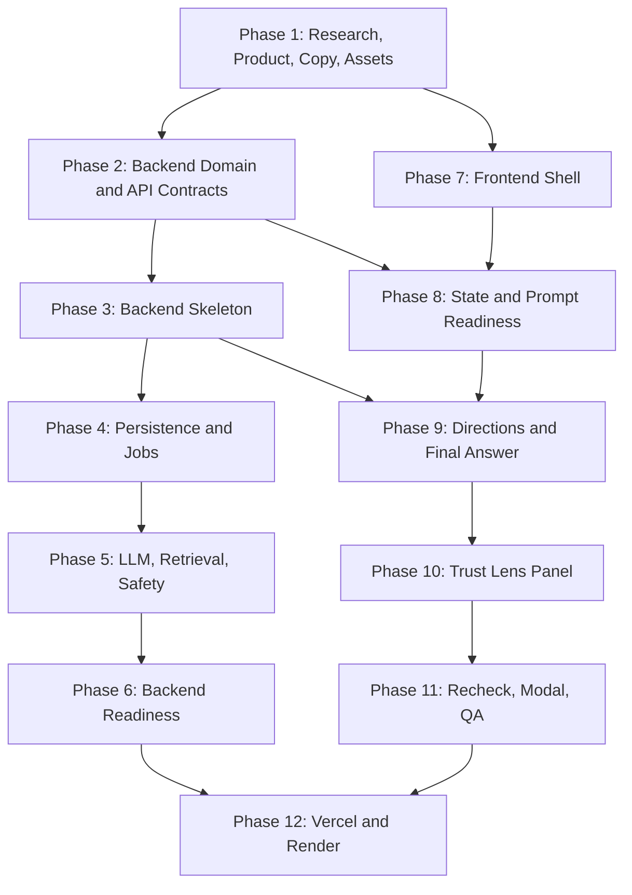

# Trust Lens 12-Phase Execution Plan

This is the detailed execution plan for building Trust Lens from documentation into a polished prototype and future-ready full-stack product.

Phase grouping:

- Phase 1: Research and assets
- Phases 2-6: Backend and microservice runway
- Phases 7-11: Frontend product UI
- Phase 12: Deployment to Vercel and Render

Primary source documents:

- `PRODUCT.md`: product intent, user jobs, copy rules, success criteria.
- `DESIGN.md`: visual system, layout, component, motion, and accessibility standards.
- `ARCHITECTURE.md`: state model, component structure, data models, guardrails.
- `screens/`: screen-by-screen UX, layout, behavior, and click actions.
- `microservice/`: future API contracts and frontend integration guide.
- `IMPLEMENTATION_CONTRACTS.md`: exact mock data, types, copy, prop interfaces, reducer guards, CSS, Tailwind, package, edge cases, and implementation checklist.

Critical product invariant:

Trust Lens must not appear before the final answer exists.

Implementation strategy:

- Fast prototype path: complete Phase 1 and Phases 7-11, then deploy frontend to Vercel in Phase 12.
- Full-stack path: complete all phases, deploy frontend to Vercel and backend to Render.
- Backend phases are documented as production runway. They should not block the frontend-only prototype unless the goal changes to full-stack demo.

## Phase 1: Research, Product Definition, Copy, And Assets

### Phase Goal

Create the product, content, interaction, and visual foundation so the build team does not invent product behavior during implementation.

### Recommended Skills

Primary:

- `$senior-pm`: product scope, user jobs, milestones, risk framing, and acceptance criteria.
- `$deep-research`: evidence boundaries, trust-related research framing, and source assumptions.
- `$content-strategy`: product copy, cautious language, and information hierarchy.

Supporting:

- `$design-taste-frontend`: visual direction and anti-generic design guardrails.
- `$impeccable`: product UI quality bar, UX clarity, and design-system context.
- `$architect-reviewer`: checks that research, product, and technical direction stay aligned.

### Source Inputs

- `PRODUCT.md`
- `DESIGN.md`
- `ARCHITECTURE.md`
- `screens/README.md`
- `screens/01-empty-state.md`
- `screens/03-prompt-readiness-check.md`
- `screens/06-final-answer.md`
- `screens/07-trust-lens-panel.md`
- `IMPLEMENTATION_CONTRACTS.md`

### Scope

This phase defines the product story, user flow, copy, mock data, evidence boundaries, and asset standards. No app code is required.

### Detailed Work

1. Confirm product register.
   - Product register must remain `product`.
   - Treat Trust Lens as a serious AI work surface, not a landing page.
   - Confirm the product promise: support human judgment, do not certify truth.

2. Confirm target users.
   - Product and design students.
   - Knowledge workers.
   - Product managers and builders.
   - AI-cautious users.

3. Define the demo narrative.
   - User begins with a vague product prompt.
   - Prompt Readiness identifies medium answer-quality risk.
   - User answers clarifying questions.
   - Improved prompt is generated.
   - User selects answer direction.
   - Final answer appears.
   - Trust Lens opens only after final answer.
   - User inspects highlights, source passage, claims, and assumptions.
   - User runs Recheck Output.
   - User chooses a final decision action.

4. Finalize product copy.
   - Empty state title and subtitle.
   - Capability card copy.
   - Prompt Readiness explanation.
   - Clarifying questions and choices.
   - Improved prompt copy.
   - Answer direction card copy.
   - Final answer text.
   - Highlight popover copy.
   - Trust Lens tab content.
   - Recheck progress copy.
   - Recheck summary copy.
   - Toast messages.

5. Lock copy rules.
   - Use `Review recommended`.
   - Use `Needs verification`.
   - Use `Medium confidence`.
   - Use `Depends on context`.
   - Use `Assumption/inference`.
   - Do not use `Verified by AI`.
   - Do not use `Trust score`.
   - Do not use `Guaranteed accurate`.
   - Do not use `Safe to use`.

6. Define mock evidence boundaries.
   - Source-backed means a passage supports a specific claim.
   - Needs verification means external validation is required.
   - Assumption means inferred from user prompt or selected direction.
   - Product logic means intended prototype behavior.

7. Create mock data inventory.
   - Use `IMPLEMENTATION_CONTRACTS.md` Section 1 as the exact source.
   - Include complete values for sample prompt, improved prompt, readiness risks, quality rows, clarification questions, answer directions, final answer blocks, highlights, Trust Lens quality rows, assumptions, missing context items, claims before recheck, claims after recheck, alternatives, recheck steps, and mock sources.

8. Define visual asset needs.
   - App mark or simple Trust Lens word treatment.
   - Sidebar identity treatment.
   - Empty state capability icons.
   - Recheck progress checkmarks.
   - Source passage modal metadata treatment.
   - Semantic highlight labels.

9. Confirm design standard.
   - Light neutral product theme.
   - Design variance `4/10`.
   - Motion intensity `3/10`.
   - Visual density `6/10`.
   - Cards use `8px` radius.
   - No decorative glassmorphism.
   - No AI-purple gradient aesthetic.

10. Prepare demo script.
    - A short walkthrough for the sample prompt.
    - State what the viewer should notice at each stage.
    - Emphasize Trust Lens appearing only after final answer.

### Deliverables

- Final copy inventory.
- Final mock data inventory.
- Demo walkthrough script.
- Asset list.
- Product rules checklist.
- Design rules checklist.

### Acceptance Criteria

- All prototype copy exists before development.
- Every screen in `screens/` has the copy needed for implementation.
- Every claim label has an evidence boundary.
- Product never claims final authority.
- Design direction is standard enough to guide implementation.
- Full sample flow can be described without ambiguity.

### Risks And Mitigations

| Risk | Mitigation |
| --- | --- |
| Product copy becomes overconfident. | Use `PRODUCT.md` trust label rules. |
| Mock evidence feels like real verification. | Label sources as mock and show exact passage boundaries. |
| Design drifts into marketing UI. | Follow `DESIGN.md` product register and density rules. |
| Developers invent missing content. | Complete mock data inventory before implementation. |

### Handoff

Phase 1 hands off to:

- Phase 2 for API and domain modeling.
- Phase 7 for frontend shell and mock implementation.

## Phase 2: Backend Domain Model, API Contracts, And Frontend Integration Design

### Phase Goal

Define future backend contracts and domain boundaries so the frontend can later switch from local mock data to API-backed data without a rewrite.

### Recommended Skills

Primary:

- `$api-designer`: endpoint design, request/response contracts, and HTTP semantics.
- `$backend-developer`: service boundaries, validation, errors, and backend domain modeling.
- `$senior-backend`: API hardening, schema quality, idempotency, and future production readiness.

Supporting:

- `$architect-reviewer`: macro architecture, coupling, and evolution path review.
- `$api-documenter`: contract documentation and developer-facing API clarity.
- `$frontend-design`: verifies API outputs support required frontend states and interactions.

### Source Inputs

- `ARCHITECTURE.md`
- `microservice/README.md`
- `microservice/api-overview.md`
- `microservice/frontend-integration.md`
- `microservice/contracts/*.json`
- `screens/13-click-action-matrix.md`

### Scope

Documentation and contract design only. No backend runtime implementation is required in this phase.

### Detailed Work

1. Confirm backend purpose.
   - Backend is future production runway.
   - Prototype can run without backend.
   - Backend must not become required for the first Vercel prototype.

2. Review endpoint sequence.
   - `POST /trust-lens/sessions`
   - `POST /trust-lens/readiness`
   - `POST /trust-lens/improved-prompt`
   - `POST /trust-lens/directions`
   - `POST /trust-lens/final-answer`
   - `POST /trust-lens/recheck`
   - `GET /trust-lens/recheck/{jobId}`
   - `GET /trust-lens/sources/{sourceId}`

3. Validate domain entities.
   - `TrustLensSession`
   - `PromptReadinessResult`
   - `ClarificationAnswer`
   - `ImprovedPrompt`
   - `AnswerDirection`
   - `GeneratedAnswer`
   - `FinalAnswerBlock`
   - `Highlight`
   - `Claim`
   - `SourcePassage`
   - `RecheckJob`

4. Validate JSON Schema contracts.
   - Every request schema validates required frontend inputs.
   - Every response schema supports the screen specs.
   - Shared definitions are centralized in `common.schema.json`.
   - Every response includes `{ data, meta }`.
   - Every error uses `{ error, meta }`.

5. Map frontend screens to API calls.
   - Empty state submit creates session and runs readiness.
   - Prompt Readiness screen consumes readiness response.
   - Improved Prompt screen consumes improved prompt response.
   - Direction screen consumes answer directions response.
   - Final Answer screen consumes final answer response.
   - Trust Lens panel consumes final answer review artifacts.
   - Recheck consumes recheck start and polling responses.
   - Source modal consumes source passage response.

6. Define frontend API client behavior.
   - Mock mode if `VITE_API_BASE_URL` is empty or `mock`.
   - API mode if `VITE_API_BASE_URL` is a URL.
   - Client functions return `ApiResult<T>`.
   - Errors do not break the whole flow if mock fallback exists.

7. Define idempotency and race guards.
   - Recheck should not start twice.
   - Final answer should only generate from selected direction.
   - Source modal should only open for source-backed highlights.
   - Trust Lens API artifacts are not displayed before final answer.

8. Define future auth and privacy notes.
   - Prototype has no auth.
   - Production needs session authorization if data persists.
   - Prompt and source retention policies must be defined before production launch.

9. Define API documentation quality checks.
   - JSON contracts parse.
   - Contract names match frontend client names.
   - No endpoint implies guaranteed correctness.
   - Error handling supports frontend fallback states.

### Deliverables

- Reviewed microservice API overview.
- Reviewed frontend integration guide.
- Final JSON Schema contract set.
- Endpoint-to-screen mapping.
- API client function inventory.
- Backend domain entity list.

### Acceptance Criteria

- Every screen action that needs backend support has a documented API.
- Every contract parses as valid JSON.
- Frontend can remain mock-first.
- Final answer response includes all artifacts needed to open Trust Lens without a second panel fetch.
- Recheck is modeled as asynchronous.
- Source passage lookup is separated from final answer generation.

### Risks And Mitigations

| Risk | Mitigation |
| --- | --- |
| Backend contracts drift from frontend mock data. | Generate frontend DTOs from schemas later or keep schema review in each PR. |
| API response encourages false certainty. | Keep trust labels constrained by `PRODUCT.md`. |
| Recheck blocks UI. | Model recheck as async job with polling. |
| Frontend becomes backend-dependent too early. | Keep mock mode as default. |

### Handoff

Phase 2 hands off to:

- Phase 3 for backend skeleton.
- Phase 8 for frontend API adapter and mock data compatibility.

## Phase 3: Backend Foundation And Mock API Service Skeleton

### Phase Goal

Create a backend service skeleton that can serve the documented contracts with deterministic mock responses.

### Recommended Skills

Primary:

- `$backend-developer`: Node/TypeScript service setup, routes, validation, middleware, and local scripts.
- `$senior-backend`: production-grade backend structure, security baseline, and error handling.
- `$api-test-suite-builder`: endpoint test scaffolding and contract test setup.

Supporting:

- `$build-engineer`: package scripts, TypeScript config, linting, and build reliability.
- `$application-security`: request validation, CORS, and defensive defaults.
- `$architect-reviewer`: confirms skeleton stays aligned with documented boundaries.

### Source Inputs

- `microservice/api-overview.md`
- `microservice/frontend-integration.md`
- `microservice/contracts/*.json`
- `ARCHITECTURE.md`
- `12_PHASE_PLAN.md`

### Recommended Stack

- Node.js.
- TypeScript.
- Fastify preferred for schema-driven APIs, Express acceptable.
- Zod or JSON Schema validation.
- Vitest or Jest.
- PostgreSQL planned, not required for skeleton.
- Redis planned, not required for skeleton.

### Detailed Work

1. Initialize backend workspace.
   - Create backend package folder when implementation begins.
   - Add TypeScript configuration.
   - Add linting and formatting.
   - Add test runner.
   - Add local dev script.

2. Add environment configuration.
   - `PORT`.
   - `NODE_ENV`.
   - `CORS_ORIGIN`.
   - `LOG_LEVEL`.
   - Future `DATABASE_URL`.
   - Future `REDIS_URL`.
   - Future provider keys, never committed.

3. Add service shell.
   - App bootstrap.
   - Route registration.
   - Request ID middleware.
   - JSON body parsing.
   - Standard error handler.
   - Health and readiness routes.

4. Add health endpoints.
   - `GET /health`: process is running.
   - `GET /ready`: dependencies are ready, mocked in skeleton.

5. Add contract-based routes.
   - `POST /api/v1/trust-lens/sessions`
   - `POST /api/v1/trust-lens/readiness`
   - `POST /api/v1/trust-lens/improved-prompt`
   - `POST /api/v1/trust-lens/directions`
   - `POST /api/v1/trust-lens/final-answer`
   - `POST /api/v1/trust-lens/recheck`
   - `GET /api/v1/trust-lens/recheck/:jobId`
   - `GET /api/v1/trust-lens/sources/:sourceId`

6. Add validation.
   - Validate all requests against schemas or equivalent Zod objects.
   - Return `VALIDATION_ERROR` with field details.
   - Reject unknown fields where contracts say `additionalProperties: false`.

7. Add deterministic mock services.
   - Return the same mock data as frontend mock mode.
   - Use stable IDs for session, answer, highlight, source, and job values.
   - Ensure final answer response includes Trust Lens artifacts.

8. Add CORS.
   - Allow local Vite origin.
   - Allow configured Vercel origin in deployed mode.

9. Add backend README.
   - Local setup.
   - Environment variables.
   - Route list.
   - Mock mode explanation.
   - How frontend connects.

### Deliverables

- Backend service skeleton.
- Route shell for every documented endpoint.
- Mock response service.
- Validation layer.
- Standard error handler.
- Health checks.
- Backend README.

### Acceptance Criteria

- Backend runs locally.
- `GET /health` returns success.
- All planned routes exist.
- Invalid request bodies return documented errors.
- Mock final answer response includes blocks, highlights, and Trust Lens data.
- Backend does not call real LLMs or retrieval providers.

### Risks And Mitigations

| Risk | Mitigation |
| --- | --- |
| Skeleton becomes overbuilt. | Keep persistence and LLM integrations out of Phase 3. |
| Mock data diverges from frontend. | Source mock data from shared JSON fixtures later. |
| CORS blocks frontend. | Test from Vite dev server early. |
| Error format is inconsistent. | Centralize error handler. |

### Handoff

Phase 3 hands off to:

- Phase 4 for persistence and async jobs.
- Phase 9 for optional backend-backed final answer integration.

## Phase 4: Backend Persistence, Recheck Jobs, And Mock-To-Real Transition

### Phase Goal

Add durable storage and async job structure so Trust Lens can support real sessions and recheck progress later.

### Recommended Skills

Primary:

- `$database-designer`: relational schema, entity relationships, and migration design.
- `$database-administrator`: database operations, connection setup, migrations, and rollback planning.
- `$backend-developer`: repositories, transactions, job state, and service integration.

Supporting:

- `$senior-backend`: async job patterns, idempotency, and data consistency.
- `$data-management`: retention policy, artifact ownership, and data lifecycle.
- `$architect-reviewer`: validates persistence boundaries and future evolution.

### Source Inputs

- `microservice/contracts/recheck-start.request.schema.json`
- `microservice/contracts/recheck-start.response.schema.json`
- `microservice/contracts/recheck-status.response.schema.json`
- `microservice/frontend-integration.md`
- `ARCHITECTURE.md`

### Detailed Work

1. Design database schema.
   - `trust_lens_sessions`
   - `prompts`
   - `prompt_readiness_results`
   - `improved_prompts`
   - `answer_directions`
   - `generated_answers`
   - `final_answer_blocks`
   - `highlights`
   - `claims`
   - `source_passages`
   - `recheck_jobs`
   - `recheck_steps`

2. Define relationships.
   - Session has many prompts.
   - Session has generated answer.
   - Answer has many blocks.
   - Answer has many highlights.
   - Answer has many claims.
   - Highlight may reference source passage.
   - Recheck job belongs to answer.

3. Add migrations.
   - Forward migration.
   - Rollback migration.
   - Seed data migration or script.
   - Local reset script.

4. Add data access layer.
   - Repositories or query modules.
   - Transaction handling.
   - Error mapping from database to API errors.

5. Add session persistence.
   - Create session.
   - Store prompt.
   - Store final answer artifacts.
   - Store recheck results.

6. Add recheck job model.
   - `queued`
   - `running`
   - `complete`
   - `failed`
   - Active step index.
   - Step statuses.
   - Failure reason.

7. Add mock async runner.
   - Simulate six steps.
   - Persist step progress.
   - Persist final claim labels.
   - Support polling.

8. Add optional Redis design.
   - Use Redis for transient job progress if needed.
   - Keep database as source of truth for completed jobs.
   - Do not require Redis for basic local demo.

9. Add cleanup policy.
   - Prototype sessions can expire quickly.
   - Production retention must be explicit.

### Deliverables

- Database schema design.
- Migrations.
- Repository layer.
- Recheck job runner.
- Seed data.
- Persistence README section.

### Acceptance Criteria

- Session can be created and stored.
- Final answer artifacts can be stored and fetched.
- Recheck job can be started, polled, completed, and persisted.
- Polling response matches contract.
- Source passages can be retrieved by ID.
- Mock mode remains deterministic.

### Risks And Mitigations

| Risk | Mitigation |
| --- | --- |
| Persistence stores sensitive prompts without policy. | Keep retention policy documented and configurable. |
| Recheck job state becomes inconsistent. | Use transactions for completion updates. |
| Polling overloads backend. | Use reasonable polling interval and rate limits later. |
| Schema overfits prototype copy. | Store typed artifacts, not only display strings. |

### Handoff

Phase 4 hands off to:

- Phase 5 for LLM and retrieval adapters.
- Phase 6 for backend readiness.

## Phase 5: Backend LLM, Retrieval, Claim Evaluation, And Safety

### Phase Goal

Define and implement a future AI orchestration layer while preserving Trust Lens evidence boundaries and user-control principles.

### Recommended Skills

Primary:

- `$llm-architect`: LLM pipeline, prompt templates, retrieval, claim evaluation, and safety boundaries.
- `$ai-engineer`: model adapter implementation, orchestration, and evaluation mechanics.
- `$ai-security`: prompt injection defense, retrieved-content safety, and unsafe output handling.

Supporting:

- `$backend-developer`: provider abstractions, retries, timeouts, and API integration.
- `$data-engineer`: retrieval data flow, source indexing, and evidence artifact handling.
- `$architect-reviewer`: checks separation between generation, retrieval, and evaluation.

### Source Inputs

- `ARCHITECTURE.md`, especially LLM architecture runway.
- `PRODUCT.md`, especially product non-goals and trust labels.
- `microservice/api-overview.md`
- `microservice/contracts/common.schema.json`

### Detailed Work

1. Create provider abstraction.
   - `PromptReadinessEvaluator`
   - `ImprovedPromptGenerator`
   - `AnswerDirectionPlanner`
   - `FinalAnswerGenerator`
   - `ClaimExtractor`
   - `QueryGenerator`
   - `Retriever`
   - `ClaimEvaluator`
   - `HighlightClassifier`

2. Add prompt template registry.
   - Version every prompt template.
   - Store template ID in metadata.
   - Keep templates separate from route handlers.
   - Include safety copy constraints.

3. Build readiness evaluator.
   - Detect missing context.
   - Detect ambiguity.
   - Detect high-stakes possible use.
   - Detect verification need.
   - Return clarifying questions.

4. Build improved prompt generator.
   - Use original prompt.
   - Use clarification answers.
   - Include goal, audience, depth, verification needs, and output constraints.

5. Build answer direction planner.
   - Return distinct directions.
   - Include recommended direction.
   - Avoid generating three near-identical cards.

6. Build final answer generator.
   - Generate structured final answer.
   - Return blocks and segments, not HTML.
   - Avoid unsupported certainty.

7. Build claim extraction.
   - Identify factual claims.
   - Identify causal claims.
   - Identify product outcome claims.
   - Identify assumptions.
   - Identify decision-critical claims.

8. Build retrieval adapter.
   - Start with mock retrieval.
   - Future adapters can use vector search, search APIs, or curated documents.
   - Retrieved content is untrusted input.

9. Build cross-reference evaluator.
   - Compare claim to source passage.
   - Assign evidence status.
   - Explain why verification is needed.
   - Never convert source support into full-answer verification.

10. Add prompt injection defense.
    - Treat retrieved text as data.
    - Do not let retrieved passages override system instructions.
    - Strip or isolate source instructions.

11. Add fallback behavior.
    - LLM timeout falls back to cautious mock-like result.
    - Retrieval failure produces `No clear evidence found`.
    - Claim evaluator failure produces `Needs verification`.

12. Add telemetry design.
    - Model latency.
    - Token use.
    - Error type.
    - Recheck duration.
    - No sensitive prompt logging by default.

### Deliverables

- LLM provider interfaces.
- Prompt template registry.
- Retrieval adapter interface.
- Claim evaluation pipeline.
- Safety and prompt injection notes.
- Fallback behavior matrix.

### Acceptance Criteria

- LLM pipeline returns the same contract shapes as mock pipeline.
- Every claim label has an explainable reason.
- Source-backed labels cite exact passages.
- No model self-review is treated as final truth.
- Failure states remain cautious and usable.
- Frontend does not need structural changes to switch providers.

### Risks And Mitigations

| Risk | Mitigation |
| --- | --- |
| Model produces overconfident output. | Enforce copy constraints and post-generation classifier. |
| Source retrieval creates false confidence. | Show exact passage and evidence boundary. |
| Prompt injection via retrieved text. | Separate source text from instructions. |
| Cost or latency grows quickly. | Track token use and support caching for safe artifacts. |

### Handoff

Phase 5 hands off to:

- Phase 6 for testing, security, observability, and deployment readiness.

## Phase 6: Backend Testing, Security, Observability, And Render Readiness

### Phase Goal

Make the backend reliable enough for a full-stack demo and future Render deployment.

### Recommended Skills

Primary:

- `$backend-developer`: integration tests, health checks, graceful shutdown, and service readiness.
- `$application-security`: validation, CORS, rate limiting, secrets, and logging safety.
- `$devops-engineer`: deployment readiness, environment configuration, and operational checks.

Supporting:

- `$api-test-suite-builder`: API and contract test coverage.
- `$dependency-auditor`: dependency and package risk review.
- `$devops-incident-responder`: logs, metrics, runtime diagnostics, and operational failure review.

### Source Inputs

- `microservice/contracts/*.json`
- `microservice/frontend-integration.md`
- `12_PHASE_PLAN.md`
- Backend implementation from Phases 3-5.

### Detailed Work

1. Add unit tests.
   - Validators.
   - Service functions.
   - Prompt template selection.
   - Claim status mapping.
   - Error response helpers.

2. Add integration tests.
   - Session create.
   - Prompt readiness.
   - Improved prompt.
   - Answer directions.
   - Final answer.
   - Recheck start.
   - Recheck polling.
   - Source passage lookup.

3. Add contract tests.
   - Validate example responses against JSON Schemas.
   - Validate request fixtures against schemas.
   - Ensure frontend DTOs match contracts.

4. Add security checks.
   - Request body size limits.
   - Input validation.
   - CORS allowlist.
   - Rate limiting for expensive endpoints.
   - Secrets only through environment variables.
   - No raw prompt logs by default.

5. Add observability.
   - Request IDs.
   - Structured logs.
   - Latency metrics.
   - Error counts.
   - Recheck job status metrics.
   - Provider timeout metrics if LLM integrated.

6. Add operational readiness.
   - Graceful shutdown.
   - Health check.
   - Readiness check.
   - Render start command.
   - Render build command.
   - Optional Dockerfile.

7. Add backend documentation.
   - Local setup.
   - Test commands.
   - Environment variables.
   - Deployment steps.
   - Troubleshooting.

### Deliverables

- Test suite.
- Contract test fixtures.
- Security checklist.
- Observability baseline.
- Render deployment config.
- Backend README updates.

### Acceptance Criteria

- Unit and integration tests pass.
- Contract fixtures validate.
- Health and readiness endpoints pass.
- Backend rejects invalid input.
- Recheck duplicate start is handled.
- CORS is configured for local and deployed frontend.
- No secrets are committed.

### Risks And Mitigations

| Risk | Mitigation |
| --- | --- |
| Full-stack demo fails because CORS is wrong. | Test deployed Vercel origin before final demo. |
| Contract drift breaks frontend. | Run contract tests in CI later. |
| Logs leak prompts. | Redact prompt fields by default. |
| Render service sleeps on free tier. | Document cold start expectation. |

### Handoff

Phase 6 hands off to:

- Phase 12 for Render deployment.

## Phase 7: Frontend Foundation, Design System, And Global Shell

### Phase Goal

Build the React app foundation and persistent ChatGPT-style shell according to product and design standards.

### Recommended Skills

Primary:

- `$frontend-design`: product UI direction, visual hierarchy, and high-quality React interface craft.
- `$design-taste-frontend`: anti-generic visual standards and design-system discipline.
- `$impeccable`: PRODUCT/DESIGN context usage, product-register UI quality, and polish standards.

Supporting:

- `$accessibility`: focus states, keyboard behavior, and semantic shell structure.
- `$build-engineer`: Vite, TypeScript, Tailwind, package scripts, and local build setup.
- `$component-recipes`: reusable layout and component patterns.

### Source Inputs

- `DESIGN.md`
- `PRODUCT.md`
- `ARCHITECTURE.md`
- `screens/00-global-shell.md`
- `screens/01-empty-state.md`
- `screens/12-responsive-mobile-tablet.md`
- `IMPLEMENTATION_CONTRACTS.md`

### Recommended Stack

- React.
- TypeScript.
- Vite.
- Tailwind CSS.
- lucide-react.
- Local reducer state.

### Detailed Work

1. Initialize frontend.
   - Vite React TypeScript app.
   - Tailwind CSS.
   - TypeScript strict mode.
   - Lint and format scripts.
   - Build script.
   - Use `IMPLEMENTATION_CONTRACTS.md` Section 10 for the package baseline.

2. Add design tokens.
   - OKLCH color tokens from `DESIGN.md`.
   - Tailwind mapping from `IMPLEMENTATION_CONTRACTS.md` Section 8.
   - Responsive CSS tokens from `IMPLEMENTATION_CONTRACTS.md` Section 6.
   - Typography stack.
   - Radius tokens.
   - Focus ring.
   - Motion easing.
   - Semantic highlight colors.

3. Build global shell.
   - `AppLayout`.
   - `Sidebar`.
   - `TopBar`.
   - `ChatArea`.
   - `Composer`.

4. Build sidebar.
   - App name `ChatGPT`.
   - Badge `Trust Lens Prototype`.
   - New chat button.
   - Mock history items.
   - Footer profile/settings row.

5. Build top bar.
   - Title `ChatGPT`.
   - Label `Trust Lens enabled`.
   - Model pill `GPT-5.5`.
   - Mobile menu button.

6. Build composer.
   - Textarea.
   - Placeholder.
   - Send icon button.
   - Empty disabled state.
   - Enter and Shift+Enter behavior.

7. Build empty state.
   - Title.
   - Subtitle.
   - Three capability cards.
   - Sample prompt button.

8. Add responsive shell.
   - Desktop sidebar visible.
   - Tablet sidebar drawer.
   - Mobile sidebar drawer.
   - Stable `100dvh` layout.

9. Add non-functional shell interactions.
   - Mock chat history toast.
   - Settings toast.
   - Model selector toast.
   - New chat reset behavior.

### Deliverables

- Running frontend app.
- Design tokens.
- Global shell.
- Sidebar.
- Top bar.
- Composer.
- Empty state.
- Responsive shell baseline.

### Acceptance Criteria

- App loads locally.
- Sample prompt fills composer.
- Send is disabled when composer is empty.
- Sidebar is visible on desktop.
- Sidebar becomes drawer on tablet/mobile.
- No Trust Lens panel appears in initial state.
- UI follows `DESIGN.md` visual rules.

### Risks And Mitigations

| Risk | Mitigation |
| --- | --- |
| Shell feels like a landing page. | Keep density product-focused and avoid hero treatment. |
| Mobile composer overlaps content. | Test small viewport early. |
| Design tokens are ignored. | Define tokens before component styling. |
| Icons are inconsistent. | Use one icon family only. |

### Handoff

Phase 7 hands off to:

- Phase 8 for reducer and prompt readiness flow.

## Phase 8: Frontend State Machine, Mock Data, Prompt Readiness, And Improved Prompt

### Phase Goal

Implement reducer-driven state and the first half of the Trust Lens journey through Improved Prompt Preview.

### Recommended Skills

Primary:

- `$frontend-design`: flow UI, prompt readiness experience, and product-quality interactions.
- `$best-practices`: reducer structure, state guards, and maintainable React patterns.
- `$debugger`: timer behavior, race conditions, and state transition troubleshooting.

Supporting:

- `$accessibility`: clarifying question groups, keyboard selection, and loading announcements.
- `$api-designer`: keeps mock API adapter compatible with documented contracts.
- `$impeccable`: checks UX clarity and copy alignment with PRODUCT/DESIGN context.

### Source Inputs

- `ARCHITECTURE.md`, sections on state model and render gates.
- `screens/02-prompt-submitted-loading.md`
- `screens/03-prompt-readiness-check.md`
- `screens/04-improved-prompt-preview.md`
- `screens/13-click-action-matrix.md`
- `microservice/frontend-integration.md`
- `IMPLEMENTATION_CONTRACTS.md`

### Detailed Work

1. Add state types.
   - Use `IMPLEMENTATION_CONTRACTS.md` Section 2 as the required type source.
   - Include `ClarificationSelections`, `QualitySignal`, `AssumptionItem`, `MissingContextItem`, `AlternativeItem`, `RecheckStep`, `ToastMessage`, and `ApiResult<T>`.

2. Add reducer.
   - Use orthogonal slices:
     - `workflowStep`.
     - `trustLensOpen`.
     - `activeTrustLensTab`.
     - `recheckStatus`.
   - `modalState`.
   - `toast`.
   - Guard invalid transitions.
   - Reset post-final state on new prompt.
   - Implement all guard resolutions from `IMPLEMENTATION_CONTRACTS.md` Section 5.

3. Add mock data module.
   - Use `IMPLEMENTATION_CONTRACTS.md` Section 1 as the exact data source.
   - Do not leave placeholders for final answer, claims, recheck steps, or sources.
   - Ensure all highlight IDs referenced in `finalAnswerBlocks` exist in `highlightDefinitions`.

4. Add copy module.
   - Use `IMPLEMENTATION_CONTRACTS.md` Section 3.
   - Keep product copy cautious and judgment-supportive.

5. Add optional API adapter shell.
   - `createTrustLensSession`.
   - `runPromptReadiness`.
   - `generateImprovedPrompt`.
   - Mock mode default.
   - No real backend required.

6. Implement prompt submit.
   - User message appears.
   - Composer clears.
   - `workflowStep = "prompt_submitted"`.
   - Immediate transition to readiness loading.
   - Timed readiness completion.

7. Build readiness loading.
   - Text: `Running Prompt Readiness Check...`.
   - Reduced motion fallback.

8. Build Prompt Readiness Card.
   - Medium answer-quality risk badge.
   - Explanation.
   - Risk chips.
   - Quality rows.
   - Clarification intro.

9. Build Clarifying Questions.
   - Three groups.
   - Default selections.
   - Selectable chips.
   - Keyboard support.

10. Add edit original prompt.
   - Reveal original prompt textarea or inline editor.
   - Save and cancel behavior.

11. Build Improved Prompt Preview.
    - Original prompt read-only section.
    - Improved prompt textarea.
    - Use improved prompt action.
    - Continue with original prompt action.
    - Disable use improved if empty.

12. Enforce Trust Lens absence.
    - No panel.
    - No collapsed rail.
    - No tabs.
    - No decision bar.

### Deliverables

- Reducer and app state types.
- Mock data module.
- Prompt submit flow.
- Prompt readiness loading.
- Prompt Readiness Card.
- Clarifying Questions.
- Improved Prompt Preview.
- Mock API adapter shell.

### Acceptance Criteria

- User can complete empty state to improved prompt preview.
- Timed readiness transition works.
- Clarification defaults are selected.
- User can edit improved prompt.
- User can continue with original or improved prompt.
- Trust Lens does not render anywhere in this phase.

### Risks And Mitigations

| Risk | Mitigation |
| --- | --- |
| Reducer mixes panel state with workflow state. | Follow orthogonal state model. |
| Timers fire after reset. | Clear timers and guard current workflow step. |
| Clarification controls are inaccessible. | Use radio group semantics or equivalent labels. |
| Trust Lens leaks early. | Add render gate tests or manual checks. |

### Handoff

Phase 8 hands off to:

- Phase 9 for answer directions and final answer.

## Phase 9: Frontend Answer Direction, Final Answer, Inline Highlights, And API Compatibility

### Phase Goal

Complete the main generation flow and render the final answer with structured inline highlights.

### Recommended Skills

Primary:

- `$frontend-design`: answer direction cards, final output readability, and highlight interaction design.
- `$accessibility`: focusable inline highlights, popovers, menus, and semantic answer structure.
- `$component-recipes`: reusable final answer, menu, button, and popover component patterns.

Supporting:

- `$api-designer`: final answer data compatibility with microservice contracts.
- `$debugger`: guards for direction selection, final answer timers, and render gates.
- `$impeccable`: visual polish and anti-slop interaction review.

### Source Inputs

- `screens/05-answer-direction-previews.md`
- `screens/06-final-answer.md`
- `screens/08-inline-highlight-popovers.md`
- `microservice/contracts/answer-directions.response.schema.json`
- `microservice/contracts/final-answer.response.schema.json`
- `DESIGN.md`
- `IMPLEMENTATION_CONTRACTS.md`

### Detailed Work

1. Add answer direction data.
   - Quick Summary.
   - Detailed Analysis.
   - Decision-Ready Output.
   - Recommended direction ID.

2. Build answer direction loading.
   - Text: `Generating answer directions...`.
   - Short timed delay.

3. Build `AnswerDirectionPreviewCards`.
   - Three cards desktop.
   - Stacked mobile.
   - Recommended visual treatment.
   - Hover state.
   - Selected state.
   - Keyboard selection.

4. Add direction selection.
   - Store selected direction.
   - Disable duplicate selection.
   - Show final answer loading text.

5. Build structured final answer data.
   - Blocks.
   - Segments.
   - Highlight IDs.
   - No raw HTML.

6. Build `FinalOutput`.
   - Title.
   - Intro.
   - Required sections.
   - Bullets.
   - Recheck Output visible button.
   - More actions menu.

7. Build `InlineHighlight`.
   - Source highlight.
   - Verify highlight.
   - Assumption highlight.
   - Product logic highlight.
   - Text labels.
   - Dotted underlines.
   - ARIA behavior from `IMPLEMENTATION_CONTRACTS.md` Section 7.

8. Build highlight popovers.
   - Hover and focus open.
   - Escape close.
   - Source action.
   - Add to recheck queue action.
   - Show in Trust Lens action.

9. Add missing prop contracts.
   - Use `IMPLEMENTATION_CONTRACTS.md` Section 4 for `LoadingMessage`, `UserMessage`, `RecheckButton`, `MoreActionsMenu`, `RecheckProgress`, and `RecheckSummary`.

10. Add final answer transition.
   - `workflowStep = "final_answer_ready"`.
   - `trustLensOpen = true`.
   - `activeTrustLensTab = "quality"`.
   - Final answer renders before panel is visible.

11. Add API compatibility.
    - Shape final answer mock data to match `final-answer.response.schema.json`.
    - Keep frontend API adapter able to swap mock response with backend response.

### Deliverables

- Answer direction loading and cards.
- Final answer loading state.
- Structured final answer rendering.
- Inline highlights.
- Highlight popovers.
- Recheck Output button.
- More actions menu.
- Final answer API-compatible mock shape.

### Acceptance Criteria

- User can choose an answer direction.
- Final answer appears after direction selection.
- Trust Lens opens only after final answer exists.
- Inline highlights are visible and focusable.
- Highlight popovers show correct actions.
- Recheck Output is visible below final answer.
- No final answer content is rendered from raw HTML.

### Risks And Mitigations

| Risk | Mitigation |
| --- | --- |
| Highlight rendering becomes brittle. | Use structured segments with stable highlight IDs. |
| Trust Lens opens before final answer. | Dispatch final answer ready only after answer data exists. |
| Popovers are hover-only. | Add focus behavior and keyboard actions. |
| More actions hides core recheck. | Keep visible Recheck Output button. |

### Handoff

Phase 9 hands off to:

- Phase 10 for Trust Lens panel and tabs.
- Phase 11 for recheck and source modal.

## Phase 10: Frontend Trust Lens Panel, Tabs, Review Data, And Decision Bar

### Phase Goal

Build the post-final Trust Lens review panel with all tabs and user decision controls.

### Recommended Skills

Primary:

- `$frontend-design`: Trust Lens panel layout, tabs, decision bar, and review information density.
- `$accessibility`: ARIA tabs, drawer behavior, focus handling, and keyboard navigation.
- `$impeccable`: product UI quality, cognitive load, and component polish.

Supporting:

- `$design-systems`: tab, drawer, button, badge, and panel consistency.
- `$component-recipes`: reusable tabs, drawer, and sticky decision bar patterns.
- `$architect-reviewer`: verifies the Trust Lens render invariant remains intact.

### Source Inputs

- `screens/07-trust-lens-panel.md`
- `screens/13-click-action-matrix.md`
- `PRODUCT.md`
- `DESIGN.md`
- `ARCHITECTURE.md`

### Detailed Work

1. Build render gate.
   - `canShowTrustLens = workflowStep === "final_answer_ready"`.
   - If false, render no panel and no rail.
   - If true and open, render panel.
   - If true and closed, render collapsed rail.

2. Build `TrustLensPanel`.
   - Header.
   - Subheader.
   - `Review recommended` badge.
   - Close button.
   - Summary section.

3. Build collapsed rail.
   - Vertical `Trust Lens` label.
   - Reopen action.
   - Only after final answer.

4. Build `TrustLensTabs`.
   - Quality.
   - Assumptions.
   - Missing Context.
   - Claims to Verify.
   - Alternatives.
   - ARIA tab behavior.

5. Build Quality tab.
   - Correctness.
   - Completeness.
   - Reasoning quality.
   - Usefulness.
   - Uncertainty.
   - Recheck Output action.

6. Build Assumptions tab.
   - Five assumption rows.
   - Impact notes.
   - Blue semantic treatment.

7. Build Missing Context tab.
   - Six missing context items.
   - Why it matters.
   - Add context action.

8. Build Claims tab.
   - Four claim cards.
   - Claim type.
   - Evidence status.
   - Why verify.
   - Suggested action.

9. Build Alternatives tab.
   - Four alternative perspectives.
   - Risk-based activation recommendation.

10. Build Decision Bar.
    - Use as draft.
    - Add context.
    - Verify first.
    - Ask alternative view.
    - Regenerate.

11. Wire decision actions.
    - Toast for use as draft.
    - Context input for add context.
    - Claims tab switch for verify first.
    - Mock assistant message for alternative view.
    - Toast or mock preview for regenerate.

12. Add responsive panel behavior.
    - Inline on desktop.
    - Right drawer on tablet.
    - Full-screen drawer on mobile.
    - Body scroll lock where needed.

### Deliverables

- Trust Lens panel.
- Collapsed rail.
- Five tabs.
- Quality rows.
- Assumption rows.
- Missing context items.
- Claim cards.
- Alternatives.
- Sticky decision bar.
- Responsive drawer behavior.

### Acceptance Criteria

- Panel appears automatically after final answer.
- Panel never appears before final answer.
- Closing panel shows rail without resetting state.
- Reopening restores prior active tab.
- Tabs are keyboard accessible.
- Decision bar actions work.
- Mobile drawer is usable.
- Copy stays cautious and judgment-supportive.

### Risks And Mitigations

| Risk | Mitigation |
| --- | --- |
| Panel state resets on close. | Store `activeTrustLensTab` separately from `trustLensOpen`. |
| Decision bar overcrowds mobile. | Allow wrap or horizontal scrolling. |
| Tabs become unreadable. | Use compact labels and horizontal scroll on mobile. |
| Claims look like final truth. | Use evidence status and why verify copy. |

### Handoff

Phase 10 hands off to:

- Phase 11 for source modal, recheck progress, summary, accessibility, and polish.

## Phase 11: Frontend Recheck, Source Modal, Accessibility, Responsive QA, And Polish

### Phase Goal

Finish the advanced interactions and run the quality pass required for a product-ready prototype.

### Recommended Skills

Primary:

- `$accessibility-tester`: keyboard-only flow, ARIA behavior, modal focus, and reduced motion checks.
- `$a11y-audit`: accessibility audit and issue prioritization.
- `$impeccable`: polish pass, visual QA, responsive behavior, and product UI hardening.

Supporting:

- `$frontend-design`: final visual refinement and interaction quality.
- `$debugger`: recheck timer, modal, toast, and edge-case bugs.
- `$core-web-vitals`: layout stability, interaction responsiveness, and performance sanity checks.

### Source Inputs

- `screens/08-inline-highlight-popovers.md`
- `screens/09-source-passage-modal.md`
- `screens/10-recheck-progress.md`
- `screens/11-recheck-summary.md`
- `screens/12-responsive-mobile-tablet.md`
- `DESIGN.md`
- `microservice/contracts/recheck-status.response.schema.json`
- `microservice/contracts/source-passage.response.schema.json`
- `IMPLEMENTATION_CONTRACTS.md`

### Detailed Work

1. Build Source Passage Modal.
   - Dialog shell.
   - Source title.
   - Mock URL label.
   - Passage text.
   - Highlighted supporting sentence.
   - Back to output button.

2. Add modal accessibility.
   - `role="dialog"`.
   - `aria-modal="true"`.
   - Focus trap.
   - Escape close.
   - Backdrop close.
   - Return focus to originating highlight.
   - Follow `IMPLEMENTATION_CONTRACTS.md` Section 7.

3. Build Recheck Progress.
   - Title: `Rechecking output...`.
   - Six steps.
   - Pending, running, complete states.
   - Checkmarks.
   - `aria-live` announcements.
   - Reduced motion support.

4. Implement recheck state.
   - `recheckStatus = "running"`.
   - `recheckProgressStep`.
   - Disable duplicate recheck.
   - Complete after timed sequence in mock mode.

5. Build Recheck Summary.
   - Title.
   - Summary paragraph.
   - Counts.
   - Open Claims.
   - View highlighted output.
   - Add missing context.

6. Update claims after recheck.
   - Supported: 1.
   - Needs verification: 2.
   - Assumption/inference: 1.
   - Conflicting evidence: 0.
   - Claims tab switches to post-recheck statuses.

7. Wire recheck actions.
   - Visible Recheck Output button.
   - Quality tab Recheck Output button.
   - More actions Recheck with Trust Lens.
   - Open panel if closed.
   - Switch to Claims tab after completion.

8. Complete toast system.
   - Add to recheck queue.
   - Context added.
   - Use as draft.
   - Regenerate.
   - Mock history/settings.

9. Run accessibility pass.
   - Keyboard path through full flow.
   - Visible focus states.
   - Tab ARIA.
   - Popover focus behavior.
   - Modal focus behavior.
   - `aria-live` for progress and toasts.
   - Color plus text for all statuses.
   - Validate against `IMPLEMENTATION_CONTRACTS.md` Section 7.

10. Run responsive QA.
    - Desktop.
    - Tablet.
    - Mobile.
    - Short viewport.
    - Long content.
    - Composer and drawer overlap.
    - Validate z-index and drawer behavior against `IMPLEMENTATION_CONTRACTS.md` Section 6.

11. Run visual polish.
    - Spacing rhythm.
    - Button contrast.
    - Card radius consistency.
    - No nested cards.
    - No decorative gradients.
    - No text overflow.
    - No layout shift on hover.

12. Add smoke tests where feasible.
    - Initial state has no Trust Lens.
    - Submit sample prompt.
    - Readiness appears.
    - Direction cards appear.
    - Final answer appears.
    - Trust Lens appears only after final answer.
    - Recheck completes.

13. Verify edge cases.
    - Use `IMPLEMENTATION_CONTRACTS.md` Section 9.
    - Confirm empty improved prompt, double recheck click, new chat during recheck, direction selection during loading, missing source fallback, orientation change, and reduced motion.

### Deliverables

- Source Passage Modal.
- Recheck Progress.
- Recheck Summary.
- Post-recheck claim updates.
- Toast system.
- Accessibility pass.
- Responsive QA pass.
- Final polish fixes.

### Acceptance Criteria

- Source-backed highlight opens source modal.
- Modal returns focus correctly.
- Recheck runs through all six steps.
- Recheck summary appears below final answer.
- Claims tab updates after recheck.
- Recheck cannot start twice.
- Keyboard-only path works.
- Mobile has no overlapping drawer/composer issues.
- UI passes design QA checklist.

### Risks And Mitigations

| Risk | Mitigation |
| --- | --- |
| Recheck feels decorative. | Update claim labels and show summary. |
| Modal traps user. | Implement close and focus return. |
| Mobile drawers overlap fixed elements. | Test with real mobile viewport sizes. |
| Accessibility is added too late. | Include keyboard behavior while building each component. |

### Handoff

Phase 11 hands off to:

- Phase 12 for deployment.

## Phase 12: Deployment To Vercel And Render

### Phase Goal

Deploy the frontend to Vercel and, when backend phases exist, deploy the backend to Render.

### Recommended Skills

Primary:

- `$deployment-engineer`: environment setup, build commands, deployment checks, and rollback planning.
- `$devops-engineer`: Render service configuration, health checks, secrets, and runtime readiness.
- `Vercel plugin`: frontend deployment to Vercel when available in the environment.

Supporting:

- `$build-engineer`: production builds, package scripts, and CI-friendly commands.
- `$frontend-design`: deployed UI smoke test across desktop and mobile.
- `$backend-developer`: backend deployment verification and API smoke tests.

### Source Inputs

- `12_PHASE_PLAN.md`
- `microservice/README.md`
- `microservice/frontend-integration.md`
- Backend README from Phase 6.
- Frontend implementation from Phases 7-11.

### Deployment Modes

#### Mode 1: Frontend-Only Prototype

Use this for the first public prototype.

- Deploy frontend to Vercel.
- Keep `VITE_API_BASE_URL` empty or set to `mock`.
- No Render backend required.
- All data comes from frontend mock data.

#### Mode 2: Full-Stack Mock Demo

Use this after backend Phases 3 and 6 are complete.

- Deploy frontend to Vercel.
- Deploy backend to Render.
- Set `VITE_API_BASE_URL` to Render API URL.
- Backend returns deterministic mock responses.

#### Mode 3: Production Runway

Use only after backend Phases 4-6 are complete.

- Deploy frontend to Vercel.
- Deploy backend to Render.
- Add database.
- Add optional Redis.
- Add provider environment variables.
- Add monitoring and rate limits.
- Add privacy and retention policy.

### Vercel Frontend Work

1. Verify build locally.
   - `npm run build`.
   - Fix TypeScript errors.
   - Fix broken imports.
   - Check asset paths.

2. Configure environment.
   - `VITE_API_BASE_URL=mock` for prototype.
   - `VITE_API_BASE_URL=<render-url>/api/v1` for full-stack mode.

3. Deploy to Vercel.
   - Connect GitHub repo.
   - Configure build command.
   - Configure output directory.
   - Add environment variables.

4. Run Vercel smoke test.
   - Load deployed URL.
   - Complete sample prompt flow.
   - Confirm Trust Lens appears only after final answer.
   - Run Recheck Output.
   - Open source passage modal.
   - Test mobile viewport.

### Render Backend Work

1. Verify backend build locally.
   - Install dependencies.
   - Run tests.
   - Start service locally.
   - Verify `/health` and `/ready`.

2. Configure Render.
   - Build command.
   - Start command.
   - Health check path.
   - Environment variables.
   - CORS origin set to Vercel URL.

3. Add database if needed.
   - Render PostgreSQL or external DB.
   - Set `DATABASE_URL`.
   - Run migrations.

4. Deploy backend.
   - Verify logs.
   - Verify health check.
   - Verify API base route.

5. Connect frontend.
   - Set Vercel `VITE_API_BASE_URL`.
   - Redeploy frontend.
   - Confirm API calls succeed.

### Deliverables

- Vercel frontend URL.
- Render backend URL if backend exists.
- Environment variable list.
- Deployment smoke test checklist.
- Known limitations list.

### Acceptance Criteria

- Frontend deployment loads.
- Full sample flow works on deployed frontend.
- No Trust Lens UI appears before final answer.
- Recheck completes on deployed frontend.
- Source modal works.
- Mobile deployed UI is usable.
- Backend health check passes if backend is deployed.
- Frontend can reach backend if API mode is enabled.
- No secrets are committed.

### Risks And Mitigations

| Risk | Mitigation |
| --- | --- |
| Vercel build fails from path or type errors. | Run local build before deploy. |
| Backend CORS blocks frontend. | Add Vercel origin to Render CORS config. |
| Render free tier cold starts. | Document expected delay and show frontend loading states. |
| Environment variable mismatch. | Keep `.env.example` documented. |
| Full-stack API fails during demo. | Keep frontend mock mode as fallback. |

## Suggested Execution Orders

### Fast Prototype Order

Use this when the immediate goal is a polished clickable demo.

1. Phase 1
2. Phase 7
3. Phase 8
4. Phase 9
5. Phase 10
6. Phase 11
7. Phase 12, Vercel frontend-only mode
8. Phase 2
9. Phase 3
10. Phase 4
11. Phase 5
12. Phase 6

### Full-Stack Order

Use this when backend integration matters during the first release.

1. Phase 1
2. Phase 2
3. Phase 7
4. Phase 8
5. Phase 3
6. Phase 9
7. Phase 4
8. Phase 10
9. Phase 5
10. Phase 11
11. Phase 6
12. Phase 12

## Phase Dependency Map

## Cross-Phase Quality Gates

### Product Gate

- Trust Lens never appears before final answer.
- No numeric trust score.
- No guaranteed accuracy language.
- User decision actions remain visible after final answer.
- Source-backed labels include evidence boundaries.

### Design Gate

- Product UI, not landing page.
- Light neutral product theme.
- Consistent radius system.
- Borders before shadows.
- No nested cards.
- No decorative glassmorphism.
- Semantic colors include text labels.

### Architecture Gate

- `workflowStep` remains separate from `trustLensOpen`.
- Recheck status remains separate from main workflow.
- Final answer is structured data.
- API mode and mock mode use compatible data shapes.

### Accessibility Gate

- Keyboard path through all major actions.
- Focus states visible.
- Tabs accessible.
- Popovers open on focus.
- Modal traps focus and returns focus.
- Recheck uses `aria-live`.
- Reduced motion respected.

### Backend Gate

- JSON contracts parse.
- Standard response and error shapes are used.
- Validation rejects invalid input.
- Recheck is asynchronous.
- No secrets committed.
- CORS configured for frontend origin.

## Global Definition Of Done

- User can complete the full sample flow without typing.
- Prompt Readiness Check appears before generation.
- Clarifying questions and Improved Prompt Preview work.
- Answer Direction Previews appear before final answer.
- Final answer renders with inline highlights.
- Trust Lens opens automatically only after final answer.
- Trust Lens tabs work.
- Source passage modal works.
- Recheck Output runs visible progress and updates claims.
- Decision bar actions work.
- Mobile and tablet layouts are usable.
- Frontend can deploy to Vercel.
- Backend can deploy to Render when backend phases are implemented.
- Documentation clearly distinguishes prototype mock behavior from future production behavior.
