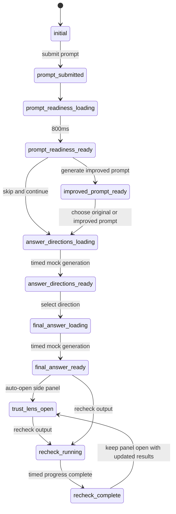

# Trust Lens Prototype Architecture

## 1. Product Intent

Trust Lens is a high-fidelity frontend prototype for a ChatGPT-style feature that helps users improve prompts, choose an answer direction, and review generated output before acting on it.

The prototype must demonstrate judgment support, not automated certainty. The interface should never imply that an AI response is guaranteed correct, fully verified, or safe to use without review.

Primary product promise:

> Trust Lens helps users refine prompts, compare answer directions, and evaluate assumptions, uncertainty, missing context, and claims before using an AI-generated response.

## 2. Scope

### In Scope

- Single-page React and TypeScript web app.
- Tailwind CSS styling.
- Local component state only.
- Mock AI responses, mock checks, mock claims, mock evidence, mock source passages, and mock recheck results.
- Simulated timed state transitions.
- Polished clickable prototype with desktop, tablet, and mobile responsive behavior.
- Accessibility support for keyboard, focus states, tabs, tooltips, modal, drawer, and reduced motion.

### Out of Scope

- Backend services.
- Real authentication.
- Real model calls.
- Real retrieval, search, citations, or verification.
- Persistence across browser sessions.
- Production data privacy, observability, rate limiting, or billing.

## 3. Core Product Invariant

The Trust Lens panel must not appear before the final answer is generated.

This rule should be represented in state and rendering:

- Before `final_answer_ready`: no right Trust Lens panel, no collapsed Trust Lens rail, no Trust Lens tabs.
- At `final_answer_ready`: final output renders first, then the Trust Lens panel opens automatically.
- If the user closes the panel after final output: show a small vertical Trust Lens reopen control.

This invariant is the most important behavioral constraint in the prototype.

## 4. Recommended Stack

- React
- TypeScript
- Vite
- Tailwind CSS
- Local React state with `useReducer`
- Optional icon library: lucide-react

No routing is required. The prototype is a single interactive flow.

## 5. Application Shell

The app uses a three-region layout:

1. Left sidebar
2. Main chat workspace
3. Right Trust Lens panel

Desktop layout:

```text
+----------------------+----------------------------------+----------------------+
| Sidebar              | Main Chat Area                   | Trust Lens Panel     |
| 260px                | Flexible                         | 420px after final    |
|                      |                                  | output only          |
+----------------------+----------------------------------+----------------------+
```

Before final answer:

```text
+----------------------+---------------------------------------------------------+
| Sidebar              | Main Chat Area                                          |
| 260px                | Centered, max-width around 760px                       |
+----------------------+---------------------------------------------------------+
```

After final answer:

```text
+----------------------+----------------------------------+----------------------+
| Sidebar              | Main Chat Area                   | Trust Lens Panel     |
| 260px                | Scrollable, composer sticky      | Slide-in review UI   |
+----------------------+----------------------------------+----------------------+
```

Mobile layout:

- Sidebar is hidden behind a menu.
- Main chat fills the viewport.
- Trust Lens opens as a full-screen drawer or bottom sheet after final answer.
- Answer direction preview cards stack vertically.
- Composer stays sticky at the bottom.

## 6. State Machine

The prototype is driven by a single app-level state machine.



Canonical state names:

```ts
type AppStep =
  | "initial"
  | "prompt_submitted"
  | "prompt_readiness_loading"
  | "prompt_readiness_ready"
  | "improved_prompt_ready"
  | "answer_directions_loading"
  | "answer_directions_ready"
  | "final_answer_loading"
  | "final_answer_ready"
  | "trust_lens_open"
  | "recheck_running"
  | "recheck_complete";
```

Recommended derived flags:

```ts
const hasFinalAnswer = [
  "final_answer_ready",
  "trust_lens_open",
  "recheck_running",
  "recheck_complete",
].includes(step);

const canShowTrustLens = hasFinalAnswer;
const showCollapsedTrustLensRail = hasFinalAnswer && !trustLensOpen;
```

## 7. App State Model

Use `useReducer` so state transitions stay predictable.

```ts
type TrustLensTab =
  | "quality"
  | "assumptions"
  | "missing_context"
  | "claims"
  | "alternatives";

type AnswerDirectionId = "summary" | "analysis" | "decision_ready";

type HighlightKind =
  | "source"
  | "verify"
  | "assumption"
  | "product_logic";

type RecheckStatus =
  | "idle"
  | "running"
  | "complete";

type AppState = {
  step: AppStep;
  composerValue: string;
  originalPrompt: string;
  editableOriginalPrompt: string;
  improvedPrompt: string;
  selectedClarifications: ClarificationSelections;
  selectedPromptMode: "original" | "improved";
  selectedDirection: AnswerDirectionId | null;
  trustLensOpen: boolean;
  activeTrustLensTab: TrustLensTab;
  activeTooltipId: string | null;
  sourceModalOpen: boolean;
  activeSourceId: string | null;
  recheckStatus: RecheckStatus;
  recheckProgressStep: number;
  recheckComplete: boolean;
  toast: ToastMessage | null;
  contextInputOpen: boolean;
  addedContextDraft: string;
};
```

## 8. Component Architecture

Top-level component tree:

```text
App
  AppLayout
    Sidebar
    MainColumn
      TopBar
      ChatArea
        EmptyState
        UserMessage
        LoadingMessage
        PromptReadinessCard
          ClarifyingQuestions
        ImprovedPromptPreview
        AnswerDirectionPreviewCards
        AssistantMessage
          FinalOutput
            InlineHighlight
            RecheckButton
            MoreActionsMenu
            RecheckSummary
      Composer
    TrustLensPanel
      TrustLensTabs
      QualityTab
      AssumptionsTab
      MissingContextTab
      ClaimsToVerifyTab
      AlternativesTab
      DecisionBar
    CollapsedTrustLensRail
    RecheckProgress
    SourcePassageModal
    Toast
```

Component ownership:

| Component | Responsibility |
| --- | --- |
| `App` | Own reducer state, dispatch actions, timed transitions, mock data wiring. |
| `AppLayout` | Desktop/tablet/mobile layout and conditional Trust Lens region. |
| `Sidebar` | ChatGPT-like navigation, history items, profile/settings footer. |
| `TopBar` | Product title, Trust Lens enabled label, model selector pill. |
| `ChatArea` | Scrollable transcript, empty state, staged cards, final answer. |
| `Composer` | Prompt input, sample prompt population, submit behavior. |
| `PromptReadinessCard` | Risk badge, detected risk chips, quality risk rows, clarification entry point. |
| `ClarifyingQuestions` | Selectable answer chips and default clarification selections. |
| `ImprovedPromptPreview` | Original prompt, editable improved prompt, prompt choice controls. |
| `AnswerDirectionPreviewCards` | Three answer direction cards, selected direction behavior. |
| `FinalOutput` | Mock answer content, inline highlights, recheck controls, result summary. |
| `InlineHighlight` | Highlight style, accessible tooltip, modal/tab actions. |
| `TrustLensPanel` | Slide-in review panel, close behavior, tab shell, sticky decision bar. |
| `TrustLensTabs` | ARIA tablist, selected tab, keyboard tab behavior. |
| `QualityTab` | Output quality signals and Recheck Output action. |
| `AssumptionsTab` | Assumption list with impact labels. |
| `MissingContextTab` | Missing context list and Add context toast behavior. |
| `ClaimsToVerifyTab` | Claim-level cards, evidence status, suggested action. |
| `AlternativesTab` | Counterarguments, trade-offs, risk-based activation recommendation. |
| `RecheckProgress` | Modal/drawer/inline progress UI with six timed steps. |
| `RecheckSummary` | Post-recheck result card below final output. |
| `SourcePassageModal` | Mock source passage viewer focused on exact supporting sentence. |
| `Toast` | Lightweight feedback for prototype actions. |

## 9. Event And Action Model

Recommended reducer actions:

```ts
type AppAction =
  | { type: "USE_SAMPLE_PROMPT" }
  | { type: "UPDATE_COMPOSER"; value: string }
  | { type: "SUBMIT_PROMPT" }
  | { type: "PROMPT_READINESS_READY" }
  | { type: "UPDATE_CLARIFICATION"; questionId: string; optionId: string }
  | { type: "GENERATE_IMPROVED_PROMPT" }
  | { type: "EDIT_ORIGINAL_PROMPT"; value: string }
  | { type: "EDIT_IMPROVED_PROMPT"; value: string }
  | { type: "CONTINUE_WITH_ORIGINAL_PROMPT" }
  | { type: "USE_IMPROVED_PROMPT" }
  | { type: "ANSWER_DIRECTIONS_READY" }
  | { type: "SELECT_ANSWER_DIRECTION"; directionId: AnswerDirectionId }
  | { type: "FINAL_ANSWER_READY" }
  | { type: "OPEN_TRUST_LENS" }
  | { type: "CLOSE_TRUST_LENS" }
  | { type: "SET_TRUST_LENS_TAB"; tab: TrustLensTab }
  | { type: "OPEN_SOURCE_MODAL"; sourceId: string }
  | { type: "CLOSE_SOURCE_MODAL" }
  | { type: "START_RECHECK" }
  | { type: "ADVANCE_RECHECK_STEP"; stepIndex: number }
  | { type: "COMPLETE_RECHECK" }
  | { type: "SHOW_TOAST"; message: string }
  | { type: "DISMISS_TOAST" }
  | { type: "OPEN_CONTEXT_INPUT" }
  | { type: "UPDATE_CONTEXT_DRAFT"; value: string }
  | { type: "ADD_CONTEXT_TO_NEXT_REVISION" }
  | { type: "ASK_ALTERNATIVE_VIEW" }
  | { type: "MOCK_REGENERATE" };
```

Timed transitions should live in `App` effects or small helper functions:

- Submit prompt -> immediately render user message.
- After submit -> `prompt_readiness_loading`.
- After 800ms -> `prompt_readiness_ready`.
- Generate directions -> `answer_directions_loading`.
- After a short delay -> `answer_directions_ready`.
- Select direction -> `final_answer_loading`.
- After a short delay -> `final_answer_ready`, then `trustLensOpen = true`.
- Recheck -> six progress steps over about 2 seconds, then `recheck_complete`.

## 10. Mock Data Architecture

Keep mock content in a dedicated module:

```text
src/data/trustLensMockData.ts
```

Suggested exports:

```ts
export const samplePrompt: string;
export const improvedPromptTemplate: string;
export const promptReadinessRisks: RiskChip[];
export const qualityRiskRows: QualityRiskRow[];
export const clarificationQuestions: ClarificationQuestion[];
export const answerDirections: AnswerDirection[];
export const finalAnswerBlocks: FinalAnswerBlock[];
export const highlightDefinitions: HighlightDefinition[];
export const trustLensQualityRows: QualitySignal[];
export const assumptions: AssumptionItem[];
export const missingContextItems: MissingContextItem[];
export const claimsBeforeRecheck: ClaimItem[];
export const claimsAfterRecheck: ClaimItem[];
export const alternatives: AlternativeItem[];
export const recheckSteps: RecheckStep[];
export const mockSources: SourcePassage[];
```

Key data interfaces:

```ts
type RiskLevel = "Low" | "Medium" | "Medium to High" | "High";

type RiskChip = {
  id: string;
  label: string;
};

type QualityRiskRow = {
  id: string;
  label: string;
  level: RiskLevel;
};

type ClarificationQuestion = {
  id: string;
  question: string;
  options: {
    id: string;
    label: string;
  }[];
  defaultOptionId: string;
};

type AnswerDirection = {
  id: AnswerDirectionId;
  title: string;
  badge: string;
  headline: string;
  description: string;
  cta: string;
  recommended?: boolean;
};

type HighlightDefinition = {
  id: string;
  kind: HighlightKind;
  label: "Source" | "Verify" | "Assumption" | "Product logic";
  text: string;
  tooltipTitle: string;
  tooltipBody: string;
  sourceId?: string;
};

type ClaimItem = {
  id: string;
  claim: string;
  type: string;
  evidenceStatus:
    | "Supported"
    | "Needs verification"
    | "Conflicting evidence"
    | "No clear evidence found"
    | "Assumption/inference"
    | "Plausible, needs testing"
    | "Uncertain";
  whyVerify: string;
  suggestedAction: string;
};
```

## 11. Final Answer Rendering Strategy

The final answer should be structured data, not a large HTML string. This keeps inline highlight behavior predictable and accessible.

Recommended shape:

```ts
type FinalAnswerBlock =
  | {
      type: "heading";
      text: string;
    }
  | {
      type: "paragraph";
      segments: FinalAnswerSegment[];
    }
  | {
      type: "section";
      title: string;
      segments: FinalAnswerSegment[];
    }
  | {
      type: "list";
      items: FinalAnswerSegment[][];
    };

type FinalAnswerSegment =
  | {
      type: "text";
      text: string;
    }
  | {
      type: "highlight";
      highlightId: string;
      text: string;
    };
```

This allows `FinalOutput` to map text segments and delegate highlighted phrases to `InlineHighlight`.

Required highlight mapping:

| Phrase | Kind |
| --- | --- |
| `evaluate AI-generated outputs before acting on them` | Source-backed |
| `detects missing context, ambiguity, and answer-quality risk` | Assumption or product logic |
| `gives users more control` | Needs verification |
| `reviews correctness, completeness, reasoning quality, usefulness, and uncertainty` | Product feature or product logic |
| `not to make users blindly trust the AI` | Source-backed or principle |
| `what they should verify before using it` | Needs verification |

## 12. Inline Highlight Interaction Contract

Highlight types:

| Type | Visual Treatment | Tooltip Label | Primary Action |
| --- | --- | --- | --- |
| Source-backed | Green dotted underline and Source label | Source-backed claim | View source passage |
| Needs verification | Amber dotted underline and Verify label | Needs verification | Add to recheck queue |
| Assumption | Blue dotted underline and Assumption label | Assumption | Show in Trust Lens |
| Product logic | Neutral or blue dotted underline and Product logic label | Product logic | Add to recheck queue |

Accessibility requirements:

- Highlights must be focusable with keyboard.
- Tooltip must appear on hover and focus.
- Tooltip content must be associated with the trigger using ARIA.
- Color must not be the only signal; visible labels are required.
- Escape should close tooltip/modal when feasible.

Prototype actions:

- View source passage -> open `SourcePassageModal`.
- Add to recheck queue -> show toast: `Added to Recheck Output.`
- Show in Trust Lens -> open panel and switch to `assumptions`.

## 13. Trust Lens Panel Architecture

Render gate:

```tsx
{canShowTrustLens && trustLensOpen ? (
  <TrustLensPanel />
) : null}

{canShowTrustLens && !trustLensOpen ? (
  <CollapsedTrustLensRail />
) : null}
```

Panel sections:

1. Header
   - Title: `Trust Lens`
   - Subheader: `Review output quality before acting on this response.`
   - Status badge: `Review recommended`
   - Close/collapse icon button

2. Summary
   - `This answer is useful as a product concept, but some claims depend on assumptions, missing context, and validation through user research.`

3. Tabs
   - Quality
   - Assumptions
   - Missing Context
   - Claims to Verify
   - Alternatives

4. Sticky decision bar
   - Use as draft
   - Add context
   - Verify first
   - Ask alternative view
   - Regenerate

Decision bar must appear after final output whenever the panel is visible. It reinforces that the user remains in control.

## 14. Trust Lens Tab Content

### Quality

Rows:

- Correctness: `Medium confidence`
- Completeness: `Good starting point`
- Reasoning quality: `Strong but simplified`
- Usefulness: `High for prototype planning`
- Uncertainty: `Medium`

Include a visible `Recheck Output` button.

Avoid numeric trust scores.

### Assumptions

Assumptions:

- The user is designing a product prototype, not a production-ready system.
- The user wants ChatGPT-like UI behavior.
- The output is intended for a product management assignment or case study.
- The user values human judgment and does not want a black-box trust score.
- The final solution should focus on output evaluation, not just hallucination detection.

Each row includes an impact note.

### Missing Context

Items:

- Target user segment is not fully defined.
- Primary use case is not locked: research, writing, coding, or career prep.
- Success metrics are not specified.
- Prototype platform is not specified: web, mobile, or browser extension.
- No constraints are given around latency, cost, or source availability.
- No decision on when Trust Lens should appear automatically versus manually.

Each item includes:

- Missing context
- Why it matters
- `Add context` action

Action behavior:

- Show toast: `Context added to next revision.`

### Claims To Verify

Before recheck, claims can use cautious statuses like:

- Needs verification
- Plausible, needs testing
- Uncertain

After recheck, update to the result label set:

- Supported
- Needs verification
- Conflicting evidence
- No clear evidence found
- Assumption/inference

Required claim examples:

- `Polished AI outputs can increase over-trust.`
- `Prompt clarification improves output quality.`
- `Source-backed highlights improve trust.`
- `Three answer previews help users choose better responses.`

### Alternatives

Counterarguments:

- Too much evaluation may slow users down.
- Users may blindly trust Trust Lens labels.
- Source-backed claims may create false confidence.
- Clarifying questions may reduce speed.

Recommendation:

`Use risk-based activation. Show full Trust Lens for high-stakes or low-context prompts, and keep it optional for simple tasks.`

## 15. Recheck Architecture

Recheck can start from:

- Visible button below final output.
- Quality tab button.
- Three-dot menu action: `Recheck with Trust Lens`.

The visible button below final output is required and must not be hidden inside the menu only.

Progress steps:

1. Claim Extraction
2. Query Generation
3. Information Retrieval
4. Cross-Referencing
5. Evaluation
6. Visual Highlighting

Recommended behavior:

- Open `RecheckProgress` as modal, drawer, or inline panel.
- Advance one step at a time over about 2 seconds total.
- On completion:
  - Set `recheckComplete = true`.
  - Update claims data to post-recheck labels.
  - Show `RecheckSummary` below final output.
  - Keep or open Trust Lens panel.
  - Switch panel to `claims` if the user clicked `Open Claims`.

Post-recheck summary:

- 4 claims reviewed
- 1 supported
- 2 need verification
- 1 assumption/inference
- 0 conflicting evidence

## 16. Responsive Architecture

Use CSS layout states rather than separate app states where possible.

Desktop:

- Sidebar visible.
- Trust Lens panel is inline on the right after final output.
- Main chat resizes or remains scrollable.

Tablet:

- Sidebar can collapse.
- Trust Lens panel becomes right overlay drawer.
- Main chat remains full usable width behind drawer.

Mobile:

- Sidebar hidden behind menu.
- Trust Lens opens as full-screen drawer or bottom sheet.
- Direction cards stack.
- Composer remains sticky.
- Long tab labels may scroll horizontally.

Suggested breakpoints:

- Mobile: below 768px.
- Tablet: 768px to 1023px.
- Desktop: 1024px and up.

## 17. Styling Architecture

Visual direction:

- ChatGPT-inspired, not a clone.
- Neutral backgrounds.
- Subtle borders.
- Moderate radii.
- Soft shadows only for layered surfaces.
- Serious AI productivity feel.
- No flashy gradients.
- No generic SaaS landing page treatment.

Color roles:

| Role | Usage |
| --- | --- |
| Neutral background | App shell, chat surface, cards. |
| Muted dark neutral | Sidebar. |
| Green | Source-backed highlight. |
| Amber | Needs-verification highlight. |
| Blue | Assumption or inferred-context highlight. |
| Red | Only serious conflict or high-risk warning. |

Important copy constraints:

Avoid:

- `This answer is 100% correct`
- `Trust score: 92%`
- `Guaranteed accurate`
- `Verified by AI`
- `You can safely use this`

Use:

- `Needs verification`
- `Medium confidence`
- `Depends on context`
- `Supported by source`
- `Assumption/inference`
- `Review recommended`
- `Useful as a starting point`

## 18. Accessibility Architecture

Required accessibility behavior:

- Buttons are native `button` elements.
- Tabs use ARIA tab patterns:
  - `role="tablist"`
  - `role="tab"`
  - `role="tabpanel"`
  - `aria-selected`
  - `aria-controls`
- Trust Lens drawer/panel has an accessible label.
- Source modal uses `role="dialog"` and `aria-modal="true"`.
- Tooltips appear on focus as well as hover.
- Focus states are visible.
- Interactive highlights are keyboard focusable.
- Recheck progress updates should be announced politely with `aria-live="polite"`.
- Reduced motion preference disables or shortens slide/fade animations.

## 19. Animation Architecture

Animations should communicate state changes only.

Use:

- Prompt Readiness card fade-in.
- Improved Prompt Preview slight slide-up.
- Answer Direction cards subtle stagger.
- Trust Lens panel slide-in from right after final answer.
- Recheck progress checkmark transitions.

Avoid:

- Decorative motion.
- Continuous background animation.
- Excessive bouncing or flashy transitions.

Respect:

```css
@media (prefers-reduced-motion: reduce) {
  * {
    animation-duration: 0.01ms !important;
    animation-iteration-count: 1 !important;
    transition-duration: 0.01ms !important;
    scroll-behavior: auto !important;
  }
}
```

## 20. Implementation File Plan

Recommended project structure:

```text
src/
  App.tsx
  main.tsx
  index.css
  components/
    layout/
      AppLayout.tsx
      Sidebar.tsx
      TopBar.tsx
    chat/
      ChatArea.tsx
      Composer.tsx
      EmptyState.tsx
      UserMessage.tsx
      AssistantMessage.tsx
      PromptReadinessCard.tsx
      ClarifyingQuestions.tsx
      ImprovedPromptPreview.tsx
      AnswerDirectionPreviewCards.tsx
      FinalOutput.tsx
      InlineHighlight.tsx
    trust-lens/
      TrustLensPanel.tsx
      TrustLensTabs.tsx
      QualityTab.tsx
      AssumptionsTab.tsx
      MissingContextTab.tsx
      ClaimsToVerifyTab.tsx
      AlternativesTab.tsx
      DecisionBar.tsx
    recheck/
      RecheckButton.tsx
      RecheckProgress.tsx
      RecheckSummary.tsx
    feedback/
      SourcePassageModal.tsx
      Toast.tsx
  data/
    trustLensMockData.ts
  state/
    appReducer.ts
    appTypes.ts
  utils/
    timing.ts
    classNames.ts
```

## 21. Build Sequence

Recommended implementation order:

1. Create React, TypeScript, Tailwind base app.
2. Build shell layout: sidebar, top bar, chat area, composer.
3. Add reducer and state machine.
4. Build initial empty state and sample prompt behavior.
5. Implement prompt submission and Prompt Readiness Check.
6. Implement clarifying questions and Improved Prompt Preview.
7. Implement Answer Direction Previews.
8. Implement final answer rendering with structured inline highlights.
9. Add Trust Lens panel with strict final-answer render gate.
10. Add tabs and decision bar.
11. Add source modal and highlight tooltips.
12. Add Recheck Output progress and summary.
13. Add responsive drawer behavior.
14. Run accessibility and visual checks.

## 22. Success Criteria Mapping

| Requirement | Architecture Support |
| --- | --- |
| Prompt Readiness starts before generation | State machine stages before answer direction and final output. |
| Clarifying questions appear | `PromptReadinessCard` owns `ClarifyingQuestions`. |
| Improved prompt preview appears | `ImprovedPromptPreview` stage after readiness. |
| Three answer previews appear before final output | `AnswerDirectionPreviewCards` stage before `final_answer_loading`. |
| Final response appears after direction selection | `SELECT_ANSWER_DIRECTION` triggers `final_answer_loading`. |
| Trust Lens appears only after final output | `canShowTrustLens` derived flag gates panel and rail. |
| Tabs exist | `TrustLensTabs` and five tab panel components. |
| Inline highlights work | Structured answer segments and `InlineHighlight`. |
| Source passage opens | `SourcePassageModal` connected to source-backed highlights. |
| Recheck runs visibly | `RecheckProgress` with six timed steps. |
| Recheck updates results | `claimsAfterRecheck` swaps in after completion. |
| User remains in control | Sticky `DecisionBar` and visible output-level actions. |
| No blind-trust copy | Copy rules and no numeric trust score design. |

## 23. Key Risks For Later Implementation

- Accidentally rendering Trust Lens before the final answer.
- Treating green source-backed highlights as fully verified truth.
- Overusing cards and making the interface feel like a generic SaaS dashboard.
- Making hover-only highlight interactions inaccessible.
- Hiding Recheck Output inside a menu instead of keeping a visible button.
- Letting timed transitions create race conditions if the user clicks quickly.
- Allowing mobile Trust Lens drawer, composer, and tabs to overlap.

## 24. Acceptance Checklist

- [ ] Empty state includes title, subtitle, three capability cards, and sample prompt button.
- [ ] Sample prompt populates composer.
- [ ] Prompt submit creates a user message and loading readiness state.
- [ ] Prompt Readiness Check appears after a timed delay.
- [ ] Clarifying questions have default selections.
- [ ] Improved prompt preview is editable.
- [ ] User can continue with original or improved prompt.
- [ ] Three answer direction cards appear before final output.
- [ ] Final answer uses structured sections and inline highlights.
- [ ] Trust Lens panel opens automatically only after final answer.
- [ ] Trust Lens can be closed and reopened after final answer.
- [ ] Trust Lens tabs are keyboard accessible.
- [ ] Inline highlights show tooltips on hover and focus.
- [ ] Source-backed highlight opens a mock source passage.
- [ ] Recheck Output button is visible below final answer.
- [ ] Recheck progress shows six steps.
- [ ] Recheck summary appears after completion.
- [ ] Claims tab updates after recheck.
- [ ] Decision bar actions show appropriate mock feedback.
- [ ] Mobile layout has no overlapping composer, panel, or tabs.
- [ ] The UI never claims final authority or guaranteed correctness.

## 25. Detailed System Architecture

The prototype has four conceptual layers:

```text
UI Shell Layer
  AppLayout, Sidebar, TopBar, ChatArea, Composer, TrustLensPanel

Interaction Layer
  InlineHighlight, Tabs, Tooltip, Modal, Toast, Direction selection, Decision actions

State Orchestration Layer
  App reducer, timed transition helpers, derived render flags, active tab/modal/toast state

Mock Domain Data Layer
  Prompt readiness data, improved prompt copy, answer directions, final answer blocks,
  highlights, claims, sources, quality signals, recheck steps
```

The app should stay intentionally frontend-only. All "AI" behavior is a deterministic presentation of mock data controlled by local state and timers.

Important architectural choice:

- The app should not store generated UI as raw HTML.
- The app should store product states and structured content.
- Components should render from typed data.
- Timers should only advance the state machine; they should not directly mutate component-local content.

This makes the flow easier to reason about and makes the "Trust Lens appears only after final output" invariant enforceable.

## 26. Full User Journey Contract

This is the exact happy path the prototype should support:

```text
1. User lands on empty state.
2. User clicks "Use sample prompt".
3. Composer is filled with sample prompt.
4. User sends prompt.
5. User message appears in transcript.
6. Prompt readiness loading appears.
7. Prompt Readiness Check card appears.
8. User reviews default clarification selections.
9. User clicks "Generate improved prompt".
10. Improved Prompt Preview appears with editable improved prompt.
11. User clicks "Use improved prompt".
12. Answer directions loading appears.
13. Three answer direction cards appear.
14. User chooses Decision-Ready Output.
15. Assistant loading message appears.
16. Final answer appears with inline highlights.
17. Trust Lens panel slides in automatically.
18. User hovers or focuses highlighted text and sees tooltip.
19. User opens a source passage from source-backed highlight.
20. User clicks "Recheck Output".
21. Recheck progress shows six steps.
22. Recheck completes.
23. Recheck Summary appears below final output.
24. Claims tab updates with post-recheck labels.
25. User can choose final decision actions from Trust Lens.
```

Alternate paths:

```text
Prompt readiness ready -> Skip and continue -> Answer directions loading
Prompt readiness ready -> Edit original prompt -> Update original prompt -> Generate improved prompt or skip
Improved prompt ready -> Continue with original prompt -> Answer directions loading
Final answer ready -> Close Trust Lens -> Collapsed Trust Lens rail appears
Collapsed rail -> Reopen Trust Lens -> Previous active tab is restored
Highlight tooltip -> Show in Trust Lens -> Trust Lens opens and Assumptions tab is selected
Highlight tooltip -> Add to recheck queue -> Toast appears
Decision bar -> Verify first -> Claims tab selected
Decision bar -> Add context -> Context input appears
Decision bar -> Ask alternative view -> Counterargument assistant message appended
```

## 27. State Transition Table

Use this table as the implementation source of truth for reducer transitions.

| Current Step | Event | Next Step | Side Effects |
| --- | --- | --- | --- |
| `initial` | `USE_SAMPLE_PROMPT` | `initial` | Set composer to sample prompt. |
| `initial` | `SUBMIT_PROMPT` | `prompt_readiness_loading` | Store original prompt, clear composer, append user message. |
| `prompt_readiness_loading` | `PROMPT_READINESS_READY` | `prompt_readiness_ready` | Render readiness card. |
| `prompt_readiness_ready` | `UPDATE_CLARIFICATION` | `prompt_readiness_ready` | Update selected clarification. |
| `prompt_readiness_ready` | `EDIT_ORIGINAL_PROMPT` | `prompt_readiness_ready` | Update editable original prompt. |
| `prompt_readiness_ready` | `GENERATE_IMPROVED_PROMPT` | `improved_prompt_ready` | Populate improved prompt template using clarification choices. |
| `prompt_readiness_ready` | `CONTINUE_WITH_ORIGINAL_PROMPT` | `answer_directions_loading` | Mark selected prompt mode as original. |
| `improved_prompt_ready` | `EDIT_IMPROVED_PROMPT` | `improved_prompt_ready` | Update editable improved prompt. |
| `improved_prompt_ready` | `USE_IMPROVED_PROMPT` | `answer_directions_loading` | Mark selected prompt mode as improved. |
| `improved_prompt_ready` | `CONTINUE_WITH_ORIGINAL_PROMPT` | `answer_directions_loading` | Mark selected prompt mode as original. |
| `answer_directions_loading` | `ANSWER_DIRECTIONS_READY` | `answer_directions_ready` | Render three preview cards. |
| `answer_directions_ready` | `SELECT_ANSWER_DIRECTION` | `final_answer_loading` | Store selected direction and append loading assistant message. |
| `final_answer_loading` | `FINAL_ANSWER_READY` | `trust_lens_open` | Render final answer, set Trust Lens open true. |
| `trust_lens_open` | `CLOSE_TRUST_LENS` | `final_answer_ready` | Hide panel but keep collapsed rail visible. |
| `final_answer_ready` | `OPEN_TRUST_LENS` | `trust_lens_open` | Reopen panel with previous tab. |
| `trust_lens_open` | `SET_TRUST_LENS_TAB` | `trust_lens_open` | Switch tab. |
| `final_answer_ready` or `trust_lens_open` | `START_RECHECK` | `recheck_running` | Open progress UI, set progress index to 0, keep Trust Lens available. |
| `recheck_running` | `ADVANCE_RECHECK_STEP` | `recheck_running` | Mark current step complete. |
| `recheck_running` | `COMPLETE_RECHECK` | `recheck_complete` | Set recheck complete, update claim statuses, show summary. |
| `recheck_complete` | `OPEN_TRUST_LENS` | `recheck_complete` | Keep completed state and open panel. |
| Any post-final step | `OPEN_SOURCE_MODAL` | Same step | Open source passage modal. |
| Any step | `SHOW_TOAST` | Same step | Show toast message. |

Guard rules:

- `SUBMIT_PROMPT` should do nothing if composer is empty after trim.
- `START_RECHECK` should do nothing before final answer exists.
- `OPEN_TRUST_LENS` should do nothing before final answer exists.
- `CLOSE_TRUST_LENS` should only change visibility, not reset tab state.
- `SELECT_ANSWER_DIRECTION` should only be accepted from `answer_directions_ready`.
- Timed completion events should be ignored if the user has moved to an incompatible step.

## 28. Reducer And Timer Design

The reducer should be pure. Timers should be coordinated outside the reducer.

Recommended approach:

```ts
function appReducer(state: AppState, action: AppAction): AppState {
  switch (action.type) {
    case "SUBMIT_PROMPT": {
      const prompt = state.composerValue.trim();
      if (!prompt) return state;

      return {
        ...state,
        step: "prompt_readiness_loading",
        originalPrompt: prompt,
        editableOriginalPrompt: prompt,
        composerValue: "",
        trustLensOpen: false,
        activeTrustLensTab: "quality",
        recheckStatus: "idle",
        recheckComplete: false,
      };
    }

    case "PROMPT_READINESS_READY": {
      if (state.step !== "prompt_readiness_loading") return state;
      return { ...state, step: "prompt_readiness_ready" };
    }

    case "FINAL_ANSWER_READY": {
      if (state.step !== "final_answer_loading") return state;
      return {
        ...state,
        step: "trust_lens_open",
        trustLensOpen: true,
        activeTrustLensTab: "quality",
      };
    }

    default:
      return state;
  }
}
```

Timer orchestration:

```ts
useEffect(() => {
  if (state.step !== "prompt_readiness_loading") return;
  const timer = window.setTimeout(() => {
    dispatch({ type: "PROMPT_READINESS_READY" });
  }, 800);
  return () => window.clearTimeout(timer);
}, [state.step]);
```

Timer durations:

| Transition | Duration |
| --- | --- |
| Prompt submitted -> readiness ready | 800ms |
| Continue -> directions ready | 700ms to 900ms |
| Direction selected -> final answer ready | 900ms to 1200ms |
| Recheck step interval | About 300ms to 350ms per step |
| Toast auto-dismiss | 2500ms to 3500ms |

Timer safety:

- Always clear timers in effect cleanup.
- Effects should depend on `state.step`, not on entire state objects.
- Reducer should validate the current step before accepting timed completion events.
- Starting a new prompt should reset recheck and modal-related state.

## 29. Message Model

Although the prototype flow can be rendered directly from `step`, a transcript model makes the UI feel more chat-like and supports the "Ask alternative view" action.

Recommended message model:

```ts
type ChatMessage =
  | {
      id: string;
      role: "user";
      createdAt: number;
      content: string;
    }
  | {
      id: string;
      role: "assistant";
      createdAt: number;
      kind:
        | "loading"
        | "prompt_readiness"
        | "improved_prompt"
        | "answer_directions"
        | "final_answer"
        | "alternative_view";
      content?: string;
    };
```

Two acceptable rendering strategies:

1. State-derived rendering
   - Simpler.
   - `ChatArea` checks `step` and renders the right staged components.
   - Best for the first build.

2. Transcript rendering
   - More realistic.
   - Reducer appends messages as the flow progresses.
   - Better if the prototype later supports multiple generated assistant messages.

Recommended for this prototype:

- Use state-derived rendering for the main staged flow.
- Add a small `extraAssistantMessages` array only for actions like `Ask alternative view`.

## 30. Component Prop Contracts

These prop contracts should guide implementation and keep components predictable.

### `AppLayout`

```ts
type AppLayoutProps = {
  hasFinalAnswer: boolean;
  trustLensOpen: boolean;
  sidebarOpen: boolean;
  children: React.ReactNode;
  sidebar: React.ReactNode;
  trustLensPanel?: React.ReactNode;
  collapsedTrustLensRail?: React.ReactNode;
};
```

Responsibilities:

- Define CSS grid/flex regions.
- Apply layout class when Trust Lens is open.
- Switch Trust Lens to overlay behavior at tablet/mobile sizes.

### `Composer`

```ts
type ComposerProps = {
  value: string;
  disabled?: boolean;
  placeholder: string;
  onChange: (value: string) => void;
  onSubmit: () => void;
};
```

Behavior:

- Enter submits unless Shift+Enter is pressed.
- Submit button disabled when value is empty.
- Composer remains sticky at bottom of main chat.
- After final output, composer may remain available but should not restart the whole flow unless submitted.

### `PromptReadinessCard`

```ts
type PromptReadinessCardProps = {
  risks: RiskChip[];
  qualityRows: QualityRiskRow[];
  questions: ClarificationQuestion[];
  selected: ClarificationSelections;
  editableOriginalPrompt: string;
  onSelectOption: (questionId: string, optionId: string) => void;
  onGenerateImprovedPrompt: () => void;
  onSkip: () => void;
  onEditOriginalPrompt: (value: string) => void;
};
```

Responsibilities:

- Display medium answer-quality risk.
- Display risk chips and quality rows.
- Render clarifying questions as radio-style chip groups.
- Keep "Generate improved prompt" as primary action.

### `ImprovedPromptPreview`

```ts
type ImprovedPromptPreviewProps = {
  originalPrompt: string;
  improvedPrompt: string;
  onEditImprovedPrompt: (value: string) => void;
  onUseImprovedPrompt: () => void;
  onContinueWithOriginal: () => void;
};
```

Responsibilities:

- Show original prompt and improved prompt.
- Make improved prompt editable.
- Preserve edited improved prompt when continuing.

### `AnswerDirectionPreviewCards`

```ts
type AnswerDirectionPreviewCardsProps = {
  directions: AnswerDirection[];
  selectedDirection: AnswerDirectionId | null;
  onSelectDirection: (directionId: AnswerDirectionId) => void;
};
```

Responsibilities:

- Render three choices.
- Mark recommended card with subtle accent border.
- On selection, show checkmark and trigger final generation.

### `FinalOutput`

```ts
type FinalOutputProps = {
  blocks: FinalAnswerBlock[];
  highlights: Record<string, HighlightDefinition>;
  recheckComplete: boolean;
  onOpenSource: (sourceId: string) => void;
  onAddToRecheckQueue: (highlightId: string) => void;
  onShowAssumption: (highlightId: string) => void;
  onRecheck: () => void;
  onOpenClaims: () => void;
  onOpenMissingContext: () => void;
};
```

Responsibilities:

- Render structured answer.
- Render `Recheck Output` button visibly below final answer.
- Render three-dot menu with `Recheck with Trust Lens`.
- Render `RecheckSummary` only after recheck is complete.

### `InlineHighlight`

```ts
type InlineHighlightProps = {
  definition: HighlightDefinition;
  children: React.ReactNode;
  onOpenSource: (sourceId: string) => void;
  onAddToRecheckQueue: (highlightId: string) => void;
  onShowAssumption: (highlightId: string) => void;
};
```

Responsibilities:

- Apply visual style based on highlight kind.
- Show label: Source, Verify, Assumption, or Product logic.
- Open tooltip on hover and focus.
- Keep action buttons keyboard accessible.

### `TrustLensPanel`

```ts
type TrustLensPanelProps = {
  activeTab: TrustLensTab;
  recheckComplete: boolean;
  claims: ClaimItem[];
  onClose: () => void;
  onTabChange: (tab: TrustLensTab) => void;
  onRecheck: () => void;
  onUseAsDraft: () => void;
  onAddContext: () => void;
  onVerifyFirst: () => void;
  onAskAlternativeView: () => void;
  onRegenerate: () => void;
};
```

Responsibilities:

- Render only after final answer exists.
- Own panel header and tab region.
- Include sticky decision bar.
- Avoid resetting selected tab when closed.

## 31. Data Contract Details

### Clarification Defaults

```ts
export const clarificationQuestions = [
  {
    id: "purpose",
    question: "What is this output mainly for?",
    defaultOptionId: "product_case_study",
    options: [
      { id: "personal_understanding", label: "Personal understanding" },
      { id: "college_project", label: "College/project submission" },
      { id: "work_presentation", label: "Work presentation" },
      { id: "product_case_study", label: "Product case study" },
      { id: "decision_making", label: "Decision-making" },
    ],
  },
  {
    id: "depth",
    question: "What level of depth do you need?",
    defaultOptionId: "decision_ready",
    options: [
      { id: "quick_summary", label: "Quick summary" },
      { id: "structured_explanation", label: "Structured explanation" },
      { id: "detailed_product_thinking", label: "Detailed product thinking" },
      { id: "decision_ready", label: "Decision-ready output" },
    ],
  },
  {
    id: "reliability",
    question: "How reliable should the final answer be?",
    defaultOptionId: "include_assumptions",
    options: [
      { id: "good_enough_draft", label: "Good enough draft" },
      { id: "careful_review", label: "Needs careful review" },
      { id: "include_assumptions", label: "Should include assumptions" },
      { id: "flag_claims", label: "Should flag claims to verify" },
    ],
  },
] satisfies ClarificationQuestion[];
```

### Answer Directions

```ts
export const answerDirections = [
  {
    id: "summary",
    title: "Quick Summary",
    badge: "Fastest",
    headline: "Best for a short overview",
    cta: "Choose summary",
  },
  {
    id: "analysis",
    title: "Detailed Analysis",
    badge: "Balanced",
    headline: "Best for understanding the full idea",
    cta: "Choose analysis",
  },
  {
    id: "decision_ready",
    title: "Decision-Ready Output",
    badge: "Recommended",
    headline: "Best match for your intent",
    cta: "Choose decision-ready",
    recommended: true,
  },
] satisfies AnswerDirection[];
```

### Highlight Definitions

```ts
export const highlightDefinitions = [
  {
    id: "h-evaluate-before-acting",
    kind: "source",
    label: "Source",
    text: "evaluate AI-generated outputs before acting on them",
    tooltipTitle: "Source-backed claim",
    tooltipBody: "This claim is supported by a retrieved source.",
    sourceId: "source-ai-output-review",
  },
  {
    id: "h-missing-context-risk",
    kind: "product_logic",
    label: "Product logic",
    text: "detects missing context, ambiguity, and answer-quality risk",
    tooltipTitle: "Product logic",
    tooltipBody: "This describes the intended behavior of the prototype and should be tested with users.",
  },
  {
    id: "h-more-control",
    kind: "verify",
    label: "Verify",
    text: "gives users more control",
    tooltipTitle: "Needs verification",
    tooltipBody: "This is a product outcome claim. Validate it through usability testing or user research.",
  },
  {
    id: "h-quality-review",
    kind: "product_logic",
    label: "Product logic",
    text: "reviews correctness, completeness, reasoning quality, usefulness, and uncertainty",
    tooltipTitle: "Product feature",
    tooltipBody: "This is a feature capability claim within the prototype.",
  },
  {
    id: "h-not-blind-trust",
    kind: "source",
    label: "Source",
    text: "not to make users blindly trust the AI",
    tooltipTitle: "Source-backed principle",
    tooltipBody: "This principle is supported by the product requirement to support human judgment.",
    sourceId: "source-human-judgment",
  },
  {
    id: "h-verify-before-using",
    kind: "verify",
    label: "Verify",
    text: "what they should verify before using it",
    tooltipTitle: "Needs verification",
    tooltipBody: "The specific verification needs depend on the task, source quality, and user context.",
  },
] satisfies HighlightDefinition[];
```

### Mock Sources

```ts
export const mockSources = [
  {
    id: "source-ai-output-review",
    title: "Mock research note: AI output review behavior",
    urlLabel: "mock://research/ai-output-review-2026",
    passage:
      "Users often rely on polished AI outputs unless the interface makes uncertainty, assumptions, and review needs visible near the generated text.",
    highlightedSentence:
      "Users often rely on polished AI outputs unless the interface makes uncertainty, assumptions, and review needs visible near the generated text.",
  },
  {
    id: "source-human-judgment",
    title: "Mock product principle: Judgment-supporting AI",
    urlLabel: "mock://principles/judgment-support-2026",
    passage:
      "Trust features should support human judgment by showing uncertainty and evidence boundaries instead of presenting an automated trust score as final authority.",
    highlightedSentence:
      "Trust features should support human judgment by showing uncertainty and evidence boundaries instead of presenting an automated trust score as final authority.",
  },
] satisfies SourcePassage[];
```

## 32. Render Gates And Visibility Rules

Use explicit render gates for every major staged component.

```ts
const showEmptyState = state.step === "initial" && !state.originalPrompt;

const showUserPrompt = state.step !== "initial" || Boolean(state.originalPrompt);

const showPromptReadinessLoading =
  state.step === "prompt_readiness_loading";

const showPromptReadinessCard = [
  "prompt_readiness_ready",
  "improved_prompt_ready",
  "answer_directions_loading",
  "answer_directions_ready",
  "final_answer_loading",
  "final_answer_ready",
  "trust_lens_open",
  "recheck_running",
  "recheck_complete",
].includes(state.step);

const showImprovedPromptPreview = [
  "improved_prompt_ready",
  "answer_directions_loading",
  "answer_directions_ready",
  "final_answer_loading",
  "final_answer_ready",
  "trust_lens_open",
  "recheck_running",
  "recheck_complete",
].includes(state.step);

const showAnswerDirections = [
  "answer_directions_ready",
  "final_answer_loading",
  "final_answer_ready",
  "trust_lens_open",
  "recheck_running",
  "recheck_complete",
].includes(state.step);

const showFinalAnswer = [
  "final_answer_ready",
  "trust_lens_open",
  "recheck_running",
  "recheck_complete",
].includes(state.step);
```

Trust Lens gates:

```ts
const canShowTrustLens =
  state.step === "final_answer_ready" ||
  state.step === "trust_lens_open" ||
  state.step === "recheck_running" ||
  state.step === "recheck_complete";

const showTrustLensPanel =
  canShowTrustLens && state.trustLensOpen;

const showCollapsedTrustLensRail =
  canShowTrustLens && !state.trustLensOpen;
```

Never derive Trust Lens visibility from:

- Whether a prompt exists.
- Whether readiness is complete.
- Whether directions are visible.
- Whether the user clicked a Trust Lens-related word earlier in the flow.

Trust Lens visibility depends only on final-answer existence.

## 33. Layout And CSS Architecture

### Desktop Grid

Recommended shell:

```css
.app-shell {
  display: grid;
  grid-template-columns: 260px minmax(0, 1fr);
  min-height: 100dvh;
}

.app-shell[data-trust-lens="open"] {
  grid-template-columns: 260px minmax(420px, 1fr) 420px;
}
```

Main column:

```css
.main-column {
  position: relative;
  display: grid;
  grid-template-rows: auto minmax(0, 1fr) auto;
  min-width: 0;
  height: 100dvh;
}

.chat-scroll {
  overflow-y: auto;
  padding-bottom: 24px;
}

.chat-content {
  width: min(100% - 32px, 760px);
  margin-inline: auto;
}

.app-shell[data-trust-lens="open"] .chat-content {
  width: min(100% - 32px, 720px);
}
```

Composer:

```css
.composer-wrap {
  position: sticky;
  bottom: 0;
  background: color-mix(in srgb, var(--app-bg) 92%, transparent);
  backdrop-filter: blur(10px);
  border-top: 1px solid var(--border-subtle);
}
```

Trust Lens:

```css
.trust-lens-panel {
  height: 100dvh;
  overflow: hidden;
  border-left: 1px solid var(--border-subtle);
  background: var(--panel-bg);
}

.trust-lens-body {
  height: 100%;
  display: grid;
  grid-template-rows: auto auto minmax(0, 1fr) auto;
}

.trust-lens-tab-content {
  overflow-y: auto;
}
```

### Tablet And Mobile

At widths below `1024px`:

```css
.app-shell,
.app-shell[data-trust-lens="open"] {
  grid-template-columns: minmax(0, 1fr);
}

.sidebar {
  position: fixed;
  inset: 0 auto 0 0;
  width: min(86vw, 320px);
  transform: translateX(-100%);
}

.sidebar[data-open="true"] {
  transform: translateX(0);
}

.trust-lens-panel {
  position: fixed;
  inset: 0 0 0 auto;
  width: min(100vw, 440px);
  z-index: 40;
}
```

At widths below `640px`:

```css
.trust-lens-panel {
  inset: 0;
  width: 100vw;
}

.answer-direction-grid {
  grid-template-columns: 1fr;
}
```

## 34. Design Token Architecture

Define token-like CSS variables in `index.css` before Tailwind utilities or inside a base layer.

```css
:root {
  --app-bg: #f7f7f5;
  --surface: #ffffff;
  --surface-muted: #f0f0ed;
  --sidebar-bg: #20211f;
  --sidebar-fg: #f4f4f1;
  --text: #202124;
  --text-muted: #62645f;
  --border-subtle: #deded8;
  --border-strong: #c7c7bf;
  --accent: #2563eb;
  --source: #1f8a4c;
  --source-bg: #eaf7ef;
  --verify: #a16207;
  --verify-bg: #fff7db;
  --assumption: #2563eb;
  --assumption-bg: #eaf1ff;
  --danger: #b42318;
  --shadow-soft: 0 12px 32px rgb(0 0 0 / 0.08);
  --radius-card: 8px;
  --radius-control: 8px;
}
```

Guidelines:

- Cards use `8px` radius.
- Buttons use clear focus rings.
- Do not use large decorative gradients.
- Do not use a one-color palette.
- Highlight labels must include text, not color alone.
- Sidebar can be dark, but chat content should remain high-contrast and readable.

## 35. Accessibility Implementation Details

### Tabs

Keyboard behavior:

- `Tab` enters the active tab.
- ArrowRight moves to next tab.
- ArrowLeft moves to previous tab.
- Home moves to first tab.
- End moves to last tab.
- Enter or Space activates focused tab if using manual activation.

Simpler acceptable version:

- Use native buttons in a `role="tablist"`.
- Click and keyboard focus work.
- Arrow key support can be added after the first pass.

### Tooltips

Tooltip requirements:

- Trigger is a `button` or focusable inline element.
- Tooltip opens on hover and focus.
- Tooltip closes on blur, mouse leave, Escape, or action click.
- Tooltip content does not trap focus unless it contains buttons.
- If tooltip contains buttons, it can behave like a small popover instead of a pure tooltip.

Recommended implementation:

- Treat highlight details as popovers because they contain actions.
- Use `aria-expanded` and `aria-controls`.
- Place popover directly after trigger in DOM.

### Modal

Source modal requirements:

- Use `role="dialog"`.
- Use `aria-modal="true"`.
- Focus first meaningful element on open.
- Return focus to the source highlight after close where feasible.
- Close on Escape and backdrop click.

### Live Regions

Use polite announcements for:

- Recheck progress step changes.
- Recheck completion.
- Toast messages.

```tsx
<div aria-live="polite" className="sr-only">
  {announcement}
</div>
```

## 36. Recheck Detailed Flow

When `START_RECHECK` fires:

1. Validate that `canShowTrustLens` is true.
2. Set `recheckStatus = "running"`.
3. Set `recheckProgressStep = 0`.
4. Open Trust Lens if it is closed.
5. Optionally keep active tab unchanged until completion.
6. Render `RecheckProgress`.

Progress state:

```ts
type RecheckProgressState = {
  status: "idle" | "running" | "complete";
  activeStepIndex: number;
  completedStepIds: string[];
};
```

Step UI state:

```ts
function getRecheckStepStatus(index: number, activeStepIndex: number) {
  if (index < activeStepIndex) return "complete";
  if (index === activeStepIndex) return "running";
  return "pending";
}
```

Completion behavior:

```ts
case "COMPLETE_RECHECK":
  if (state.step !== "recheck_running") return state;
  return {
    ...state,
    step: "recheck_complete",
    recheckStatus: "complete",
    recheckComplete: true,
    recheckProgressStep: recheckSteps.length,
    trustLensOpen: true,
    activeTrustLensTab: "claims",
  };
```

After completion:

- `ClaimsToVerifyTab` reads from `claimsAfterRecheck`.
- `FinalOutput` renders `RecheckSummary`.
- Inline highlights may keep the same visual categories, but labels can show updated status in tooltip copy.
- Recheck modal can close automatically after a short success state, or require the user to close it.

Recommended prototype behavior:

- Show `Recheck complete` inside the progress surface.
- After 700ms, close progress surface.
- Show summary below final answer.
- Switch Trust Lens to Claims tab.

## 37. Source Passage Modal Contract

The source viewer should feel like the user is taken to the exact supporting sentence, even though it is mock data.

Modal content:

- Header: `Source passage`
- Source title.
- URL placeholder, visually styled like metadata.
- Passage text.
- Highlighted supporting sentence.
- `Back to output` button.

Data:

```ts
type SourcePassage = {
  id: string;
  title: string;
  urlLabel: string;
  passage: string;
  highlightedSentence: string;
};
```

Behavior:

- Opening from a source-backed highlight sets `activeSourceId`.
- Modal resolves source with `mockSources.find`.
- If source is missing, modal should show a graceful fallback: `Source passage unavailable in prototype.`
- Back button closes modal and returns focus to output area.

## 38. Toast And Lightweight Feedback

Toast messages should be used for prototype-only actions that do not need full state changes.

Toast examples:

| Action | Toast |
| --- | --- |
| Add to recheck queue | `Added to Recheck Output.` |
| Missing context Add context | `Context added to next revision.` |
| Use as draft | `Marked as draft. Review before sharing externally.` |
| Regenerate | `Mock regenerated answer preview prepared.` |
| Save context | `Context saved for the next revision.` |

Toast behavior:

- One toast visible at a time.
- Auto-dismiss after about 3 seconds.
- Dismissible by close button.
- Announced through `aria-live`.

## 39. Error, Empty, And Edge States

Even as a prototype, handle these gracefully:

| Scenario | Expected Behavior |
| --- | --- |
| Empty composer submit | Do nothing or keep submit disabled. |
| User edits improved prompt to empty | Keep button enabled only if text is non-empty, or fall back to original prompt. |
| User closes Trust Lens | Keep final answer visible, show collapsed rail. |
| User starts recheck while panel closed | Open panel and show progress. |
| User clicks Recheck repeatedly | Ignore duplicate clicks while `recheckStatus = "running"`. |
| User opens source modal during recheck | Allow it, or pause interaction behind modal; recheck continues. |
| User selects tooltip action before final output | This should not occur because highlights only exist in final output. |
| Viewport shrinks while panel open | Panel becomes overlay/full-screen drawer. |
| Reduced motion enabled | Skip slide/stagger animations. |

Race condition prevention:

- Disable direction cards after one is selected.
- Disable recheck button while running.
- Ignore timed events if current step no longer matches expected source step.
- Clear toast timers when a new toast replaces the old one.

## 40. Scroll Management

The chat area should feel conversational.

Rules:

- When user submits prompt, scroll to bottom.
- When readiness card appears, scroll to the card.
- When improved prompt appears, scroll enough to reveal its header.
- When answer directions appear, scroll to the direction section.
- When final answer appears, scroll to final answer start, not necessarily all the way to the bottom.
- When recheck summary appears, scroll to summary only if recheck was triggered from below final output.

Implementation:

```ts
const finalAnswerRef = useRef<HTMLDivElement | null>(null);

useEffect(() => {
  if (showFinalAnswer) {
    finalAnswerRef.current?.scrollIntoView({
      block: "start",
      behavior: prefersReducedMotion ? "auto" : "smooth",
    });
  }
}, [showFinalAnswer, prefersReducedMotion]);
```

Do not scroll the Trust Lens panel when the main chat scrolls. The panel owns its own scroll container.

## 41. Testing And Verification Plan

Minimum manual verification:

- Load app and confirm empty state.
- Click sample prompt and confirm composer fills.
- Submit prompt and confirm readiness loading then readiness card.
- Confirm default clarification selections.
- Generate improved prompt and edit textarea.
- Continue with improved prompt and confirm directions loading.
- Select Decision-Ready Output.
- Confirm final answer appears before Trust Lens panel.
- Confirm Trust Lens panel never appears before final answer.
- Close Trust Lens and confirm collapsed rail appears.
- Reopen Trust Lens and confirm selected tab persists.
- Test each tab.
- Hover and keyboard-focus each highlight.
- Open source passage modal.
- Run Recheck Output.
- Confirm six progress steps.
- Confirm summary appears.
- Confirm Claims tab updates.
- Test mobile viewport.
- Test keyboard-only path through tabs and major actions.

Potential automated checks:

```text
Render initial app:
  expect Trust Lens panel not present.

Submit sample prompt:
  expect readiness loading.
  await readiness ready.
  expect Trust Lens panel not present.

Continue through directions:
  expect Trust Lens panel not present.

Select final direction:
  await final answer.
  expect final answer present.
  expect Trust Lens panel present.

Run recheck:
  expect progress steps.
  await completion.
  expect Recheck Summary present.
  expect Claims tab has post-recheck labels.
```

## 42. Implementation Guardrails

During implementation, preserve these guardrails:

- Do not introduce API clients.
- Do not introduce authentication.
- Do not add a landing page.
- Do not use a numeric trust score.
- Do not present source-backed highlights as universal truth.
- Do not make the Trust Lens panel available before final answer.
- Do not make the final answer a raw HTML string.
- Do not hide Recheck Output only in a three-dot menu.
- Do not rely on color alone to communicate evidence status.
- Do not allow mobile overlays to cover the composer in an unusable way.

## 43. Detailed File Responsibilities

```text
src/App.tsx
  Creates reducer, owns timers, computes derived flags, wires layout.

src/state/appTypes.ts
  Central TypeScript types for state, actions, mock data, tabs, highlights.

src/state/appReducer.ts
  Pure reducer with guarded transitions.

src/data/trustLensMockData.ts
  All static prototype content.

src/components/layout/AppLayout.tsx
  Responsive shell and conditional panel regions.

src/components/layout/Sidebar.tsx
  Navigation-like sidebar with mock chat history.

src/components/layout/TopBar.tsx
  Header row with ChatGPT label, Trust Lens enabled label, model pill.

src/components/chat/ChatArea.tsx
  Scrollable transcript and staged flow composition.

src/components/chat/Composer.tsx
  Prompt input, submit button, keyboard behavior.

src/components/chat/EmptyState.tsx
  Initial welcome state, capability cards, sample prompt button.

src/components/chat/PromptReadinessCard.tsx
  Risk summary and clarification controls.

src/components/chat/ImprovedPromptPreview.tsx
  Original/improved prompt comparison and editable improved prompt.

src/components/chat/AnswerDirectionPreviewCards.tsx
  Three answer direction options.

src/components/chat/FinalOutput.tsx
  Structured final answer with highlights and recheck actions.

src/components/chat/InlineHighlight.tsx
  Highlight trigger, label, popover, source/recheck/tab actions.

src/components/trust-lens/TrustLensPanel.tsx
  Panel shell, header, summary, tabs, decision bar.

src/components/trust-lens/TrustLensTabs.tsx
  Accessible tablist and tabpanel routing.

src/components/trust-lens/*Tab.tsx
  Individual tab content.

src/components/trust-lens/DecisionBar.tsx
  Sticky decision actions after final output.

src/components/recheck/RecheckProgress.tsx
  Recheck progress modal/drawer/inline panel.

src/components/recheck/RecheckSummary.tsx
  Completed recheck result below final answer.

src/components/feedback/SourcePassageModal.tsx
  Mock evidence source viewer.

src/components/feedback/Toast.tsx
  App-level toast display.

src/utils/classNames.ts
  Small class merge helper if needed.

src/utils/timing.ts
  Shared duration constants and reduced-motion helpers if needed.
```

## 44. Definition Of Done For The Architecture

This architecture is detailed enough for implementation when it answers:

- What should render at every stage?
- Which state owns every important behavior?
- What data shape powers every UI section?
- What actions are allowed from every stage?
- How is Trust Lens prevented from appearing too early?
- How are highlights, sources, claims, and recheck connected?
- How does the layout change across desktop, tablet, and mobile?
- What accessibility requirements must be built into the components?
- What edge cases should be handled in the prototype?

Any implementation should treat sections 3, 27, 28, 32, and 42 as hard constraints.
